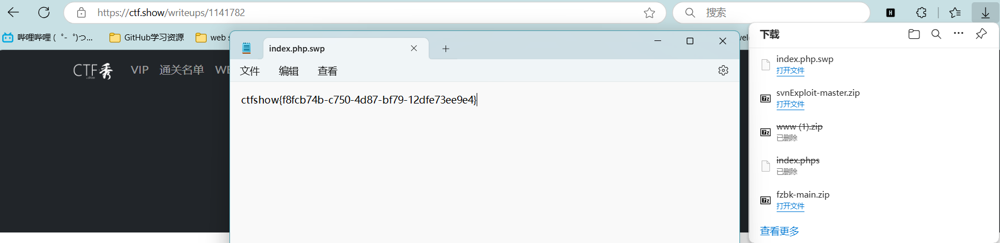
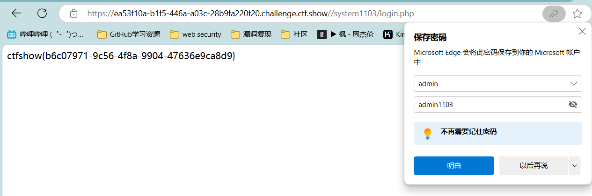

# 信息收集

## Web1

查看源码

## Web2

无法查看源码抓包

## Web3

抓包发现flag的http头

## Web4

robots.txt


flag:`ctfshow{7c7e8d8e-1f71-44cf-994f-657a10282c23}`

## Web5

phps作为备份文件，泄露了源码。

其他常见的有linux的备份文件，比如index.php.swp

备份文件扫描工具https://github.com/shanyuhe/fzbk

常见网站备份文件字典[Fuzzing-Dicts/常见网站备份文件字典（2954）.txt at master · 3had0w/Fuzzing-Dicts · GitHub](https://github.com/3had0w/Fuzzing-Dicts/blob/master/常见网站备份文件字典（2954）.txt)

访问index.phps查看到备份文件


## Web6

根据提示`解压源码到当前目录，测试正常，收工`测试完未清理zip就收工了，直接fuzz找源码备份文件

[Fuzzing-Dicts/常见网站备份文件字典（2954）.txt at master · 3had0w/Fuzzing-Dicts · GitHub](https://github.com/3had0w/Fuzzing-Dicts/blob/master/常见网站备份文件字典（2954）.txt)


找到源码zip


flag `flag{flag_here}`


## Web7

根据提示`版本控制很重要，但不要部署到生产环境更重要。`想到git


turing_wue of 师傅对git信息泄露的解释：

.git信息泄露漏洞
详情见：
https://blog.csdn.net/qq_45521281/article/details/105767428
开发人员在开发时，常常会先把源码提交到远程托管网站（如github），最后再从远程托管网站把源码pull到服务器的web目录下，如果忘记把.git文件删除，就造成此漏洞。利用.git文件恢复网站的源码，而源码里可能会有数据库的信息。
当前大量开发人员使用git进行版本控制，对站点自动部署。 如果配置不当，可能会将.git文件夹直接部署到线上环境，这就引起了git泄露漏洞。
在一个目录中初始化一个仓库以后 , 会在这个目录下产生一个名叫 .git 的隐藏文件夹（版本库）这个文件夹里面保存了这个仓库的所有版本等一系列信息
解：
根据提示，可能是.git导致信息泄露，访问url/.git 即可获取flag
也可用dirsearch工具扫描目录，扫到有url/.git 这个目录，访问获取flag即可

### 拓展：git信息泄露利用

githack利用

[[Python/网络安全\] Git漏洞之Githack工具基本安装及使用详析 - 秋说 - 博客园 (cnblogs.com)](https://www.cnblogs.com/qiushuo/p/17454497.html)

## Web8

根据提示`版本控制很重要，但不要部署到生产环境更重要。`想到git

/.git/没用直接fuzz


与git一样，SVN也是常用的代码版本管理工具

### 拓展：svn信息泄露利用

[《SVN源代码泄露利用工具-SvnExploit》升级版 | AdminTony's Blog](http://www.admintony.com/svnExploit-update.html)

工具：该工具使用python2运行

[GitHub - admintony/svnExploit: SvnExploit支持SVN源代码泄露全版本Dump源码](https://github.com/admintony/svnExploit?tab=readme-ov-file)

## Web9

提示`发现网页有个错别字？赶紧在生产环境vim改下，不好，死机了`

在使用vim修改文件时会创建一个 `文件名.swp` 的临时文件意外退出时该文件会保留

所以尝试访问 index.php.swp 



> 在Vim编辑器中，临时文件通常是指那些在编辑过程中创建的，用于保存编辑状态的文件。这些文件通常在退出Vim时被删除，但有时它们会因为各种原因（如程序崩溃、强制退出等）而保留下来。以下是一些常见的Vim临时文件类型：
>
> 1. **交换文件（Swap file）**：
>    - Vim在编辑文件时会创建交换文件，用于保存编辑过程中的状态，以便在崩溃时恢复。
>    - 默认情况下，交换文件的名称是原文件名后加上`.swp`扩展名，例如，编辑`example.txt`时，交换文件可能是`example.txt.swp`。
>    - 可以通过`:set directory?`查看交换文件的存放目录。
>
> 2. **撤销文件（Undo file）**：
>    - Vim允许撤销编辑操作，撤销信息会保存在撤销文件中。
>    - 撤销文件的名称通常是原文件名后加上`~`，例如，编辑`example.txt`时，撤销文件可能是`example.txt~`。
>    - 可以通过`:set undodir?`查看撤销文件的存放目录。
>
> 3. **备份文件（Backup file）**：
>    - 当你对一个文件进行写操作时，Vim可能会创建一个备份文件，以防覆盖原文件。
>    - 备份文件的名称通常是原文件名后加上`.bak`扩展名，例如，编辑`example.txt`时，备份文件可能是`example.txt.bak`。
>
> 4. **自动保存文件（Auto-save file）**：
>    - Vim有时也会创建自动保存文件，用于保存编辑过程中的自动保存状态。
>    - 这些文件的名称可能与原文件名不同，具体取决于Vim的配置。
>
> 要管理这些临时文件，你可以使用以下Vim命令：
>
> - `:sw`或`:swap`：查看当前文件的交换文件位置。
> - `:unDO`：查看当前文件的撤销文件位置。
> - `:e!`：强制重新加载文件，忽略交换文件。
> - `:bdelete #`：删除编号为`#`的缓冲区的交换文件。
> - `:set swapfile`：关闭交换文件的创建。
> - `:set noswapfile`：关闭交换文件的创建。
> - `:set undodir`：设置撤销文件的存放目录。
> - `:set backupdir`：设置备份文件的存放目录。
>
> 请注意，临时文件的创建和删除取决于你的Vim配置和个人偏好。你可以通过修改Vim的配置文件（通常是`.vimrc`）来调整这些行为。


 ## web10

提示 `cookie 只是一块饼干，不能存放任何隐私数据`

抓包看cookie


也可以浏览器F12查看


## Web11 
提示 `域名其实也可以隐藏信息，比如flag.ctfshow.com 就隐藏了一条信息`
访问 flag.ctfshow.com 不能解析出服务器ip

根据下面提示知道这不是一条A记录而是txt记录


使用命令 nslookup -type=TXT flag.ctfshow.com 解析txt记录

或者用 nsloopup -type=any flag.ctfshow.com 解析出全部记录

不过应该是题目dns解析过期了,试了几种查询方式都没有解析出来直接提交题目给的flag


### 拓展

> `nslookup` 是一个用于查询 DNS（域名系统）以查找域名与 IP 地址映射的工具。它可以用来诊断网络问题，比如域名解析问题。以下是 `nslookup` 的一些基本用法：
>
> 1. **查询 A 记录（将域名解析为 IPv4 地址）**：
>
>    bash
>
>    ```bash
>    nslookup example.com
>    ```
>
> 2. **查询 AAAA 记录（将域名解析为 IPv6 地址）**：
>
>    bash
>
>    ```bash
>    nslookup -type=AAAA example.com
>    ```
>
> 3. **查询 MX 记录（查找邮件交换服务器）**：
>
>    bash
>
>    ```bash
>    nslookup -type=MX example.com
>    ```
>
> 4. **查询 NS 记录（查找域名服务器）**：
>
>    bash
>
>    ```bash
>    nslookup -type=NS example.com
>    ```
>
> 5. **查询 TXT 记录**：
>
>    bash
>
>    ```bash
>    nslookup -type=TXT example.com
>    ```
>
> 6. **指定 DNS 服务器进行查询**：
>
>    bash
>
>    ```bash
>    nslookup example.com 8.8.8.8
>    ```
>
>    这里使用 Google 的公共 DNS 服务器 `8.8.8.8` 来解析 `example.com`。
>
> 7. **查看所有记录**：
>
>    bash
>
>    ```bash
>    nslookup -type=any example.com
>    ```
>
> 8. **设置默认服务器**： 在命令行中，你可以使用 `set` 命令来设置默认的 DNS 服务器：
>
>    bash
>
>    ```bash
>    nslookup
>    > set type=A
>    > set server 8.8.8.8
>    > example.com
>    ```
>
> 9. **退出 nslookup**： 在 `nslookup` 的交互模式下，你可以输入 `exit` 或者按 `Ctrl+C` 来退出。
>
> 请注意，`nslookup` 的具体用法可能会根据你的操作系统和 `nslookup` 的版本有所不同。在某些系统中，比如 macOS，你可能需要使用 `dig` 或者 `host` 命令来替代 `nslookup`，因为 `nslookup` 在 macOS 中可能不支持所有功能。


## Web12
访问发现是个购物页面

根据提示 `有时候网站上的公开信息，就是管理员常用密码` 直接尝试找登录页面，以及登录账号密码


浏览了下页面找到了敏感信息电话号码


然后随便试了下几个路径就找到了登录界面 `/admin` 当然可以目录扫描也是可以扫描出来的


看见要输入账号密码先试了下372619038/372619038没有登录进去，就想着试下几个常见的用户名，直接第一个admin/372619038 就登录进去了 


## Web13

点进去是一个什么电视盒子的官方网站 根据提示 `技术文档里面不要出现敏感信息，部署到生产环境后及时修改默认密码` 直接找敏感信息和文档


翻了半天没找到都打算去网页模板找了，突然发现了个document


这个是可以点的，点进去是个pdf技术文档


用给的账号密码和路径直接登录，拿到flag




## Web14

点进去一样是个门户网站，全是静态页面，翻了半天没翻到什么入手点


根据提示 `有时候源码里面就能不经意间泄露重要(editor)的信息,默认配置害死人` 提到了editor 想到可能是页面编辑器，翻了下网页源码发现是一个路径/editor,进去确实是一个页面编辑器


常规思路试下编辑器能不能上传webshell,结果没有权限写入


不过在上传图片的时候看到个图片空间试着点进去


发现直接干到根目录了找到/var/www/html路径发现有一个nothinghere目录里面就是flag


直接访问url/nothinghere/fl000g.txt获得flag


## Web15

点进去是个卖票的网站


目录爆破发现有个 /admin 路径


里面是登录界面


根据提示`公开的信息比如邮箱，可能造成信息泄露，产生严重后果`

找到邮箱


尝试用邮箱登录无法进入


发现有忘记密码选项这里使用提问的方式重置密码


询问所在城市，尝试从qq入手


找到所在城市西安


重置密码登录后获取flag


## web16

点进去是个纯html+js的静态页面

看提示 `对于测试用的探针，使用完毕后要及时删除，可能会造成信息泄露` 没看懂但是知道要找东西，开始以为是测试页面之类的东西，dirfuzz试了下没什么东西，然后觉得从js源码看看会不会泄露什么测试路径，也没找到。后面去搜了下php探针这东西才有思路，就是留了个测试监控页面忘记删了，默认页面是tz.php，由于字典里没这个路径，之前fuzz没试出来。

直接访问tz.php，就是一个服务器性能监控和测试的页面


浏览了下发现数据库，试了下数据库连接不上，另外还发现了phpinfo是可以访问的


点击访问phpinfo ctrl+F 检索找到flag


### 拓展
> PHP探针是一个用于检测和展示服务器环境信息和相关配置的工具。它在网站运维、服务器管理和故障排查中发挥着重要作用，可以快速提供包括PHP版本、操作系统类型、Web服务器软件、PHP扩展、内存使用、文件上传限制、MySQL数据库状态、服务器时间和时区、服务器负载及磁盘空间等在内的关键信息。通过执行特定PHP代码，探针可以获取并展示这些信息，从而帮助开发者和系统管理员优化和维护服务器性能。
>
> PHP探针的主要功能包括：
> 1. 服务器环境探测：包括CPU、在线时间、内存使用状况、系统平均负载探测（支持Linux、FreeBSD系统，需系统支持），操作系统、服务器域名、IP地址、解释引擎等。
> 2. PHP基本特征探测：版本、运行方式、安全模式及常规参数。
> 3. PHP组件支持探测：如MYSQL、GD、XML、SESSION、SOCKET等组件支持情况。
> 4. 服务器性能检测：包括整数运算能力、浮点数运算能力、数据IO能力。
> 5. 自定义探测：如MYSQL连接测试、MAIL发信测试、函数支持情况及PHP配置参数。
>
> 使用PHP探针时，你可以通过上传探针文件到服务器，并访问相应的URL来查看服务器的详细状态和信息。例如，X探针（又名刘海探针、X-Prober）是一款由INN STUDIO开发的开源PHP探针，它具有美观简洁的界面、高效的运行效率和丰富的功能，能高精度显示服务器的相应信息，支持PHP5.4+环境。
>
> 在使用PHP探针时，应注意潜在的安全风险，尤其是在生产环境中。应限制探针的访问权限，避免敏感信息泄露，并确保数据传输的安全性。此外，探针的兼容性和错误调试也是使用过程中需要注意的问题。

## Web17

根据提示 `备份的sql文件会泄露敏感信息` 直接dirfuzz


flag就在备份文件中

## Web18

鸟人游戏 提示 `不要着急，休息，休息一会儿，玩101分给你flag`


包不可能玩的直接找js源码，当分数大于100时弹窗输出这句话


控制台直接运行 `window.confirm("\u4f60\u8d62\u4e86\uff0c\u53bb\u5e7a\u5e7a\u96f6\u70b9\u76ae\u7231\u5403\u76ae\u770b\u770b");`


TMD刚开始没看懂搜了下.............


## Web19

提示 `密钥什么的，就不要放在前端了`直接找源码


直接输入账号密码显示密码错误，发现有个前端加密


是直接抓包改参数，随便输个密码提交


bp抓包修改加密后的密码为 a599ac85a73384ee3219fa684296eaa62667238d608efa81837030bd1ce1bf04


flag


## Web20

提示`mdb文件是早期asp+access构架的数据库文件，文件泄露相当于数据库被脱裤了。`

直接dirfuzz，bp字典没扫出来，换dirsearch，扫除/db/目录但是403


提示提到了mdb文件，搜一下早期asp+access架构的数据库文件为db.mdb，访问后下载得到mdb文件


记事本打开检索flag


### 拓展

可以用Microsoft Access打开访问mdb文件
